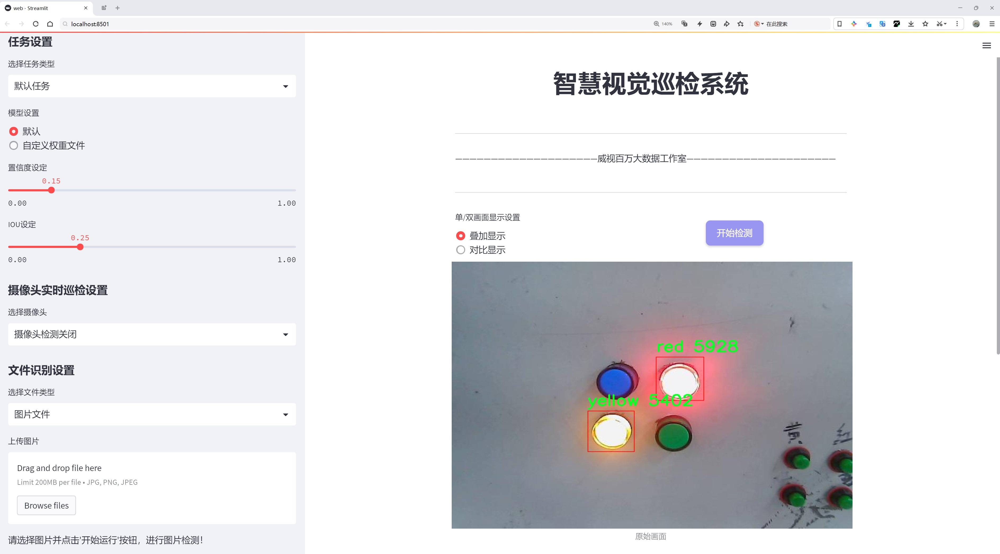
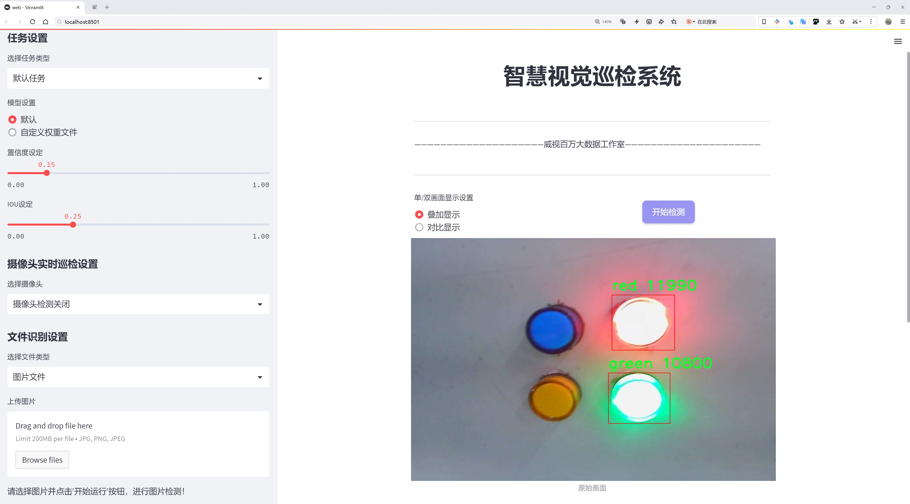
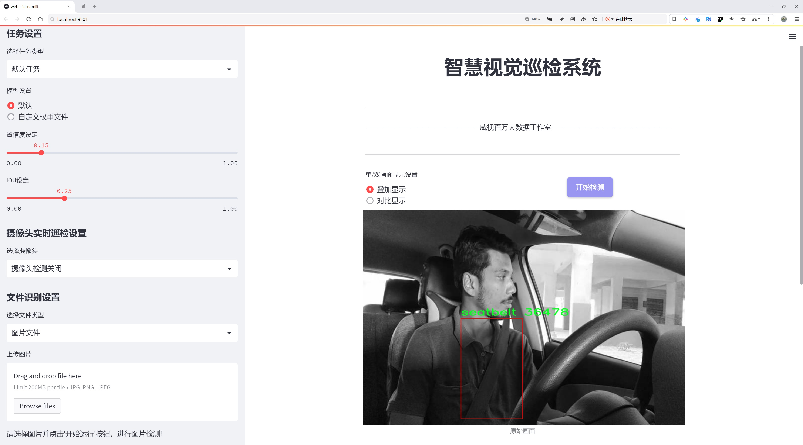
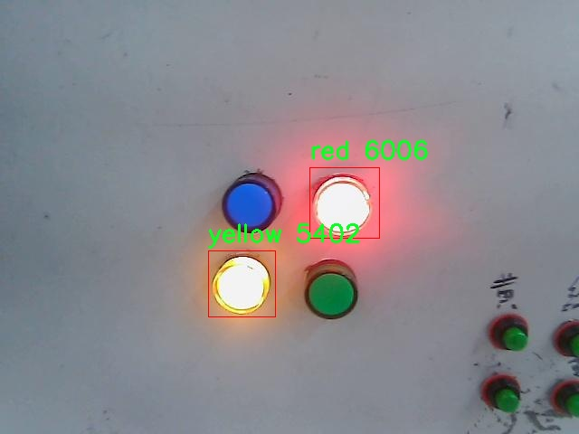
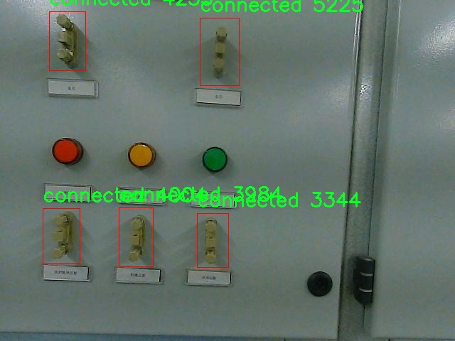
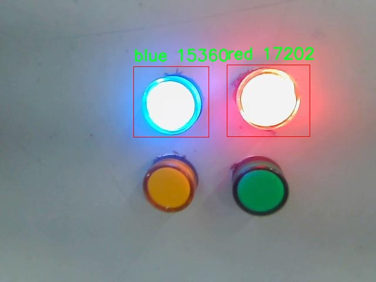
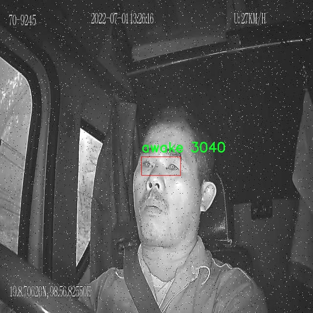

# 电气设备状态检测检测系统源码分享
 # [一条龙教学YOLOV8标注好的数据集一键训练_70+全套改进创新点发刊_Web前端展示]

### 1.研究背景与意义

项目参考[AAAI Association for the Advancement of Artificial Intelligence](https://gitee.com/qunshansj/projects)

项目来源[AACV Association for the Advancement of Computer Vision](https://gitee.com/qunmasj/projects)

研究背景与意义

随着工业自动化和智能化的迅速发展，电气设备的状态监测与故障诊断在保障电力系统安全、提高设备运行效率方面变得愈发重要。传统的电气设备状态检测方法主要依赖人工巡检和定期维护，这不仅耗时耗力，而且在一定程度上容易受到人为因素的影响，导致检测结果的准确性和及时性不足。因此，基于计算机视觉和深度学习技术的自动化检测系统逐渐成为研究的热点。尤其是YOLO（You Only Look Once）系列目标检测算法，以其高效性和实时性在各类视觉识别任务中展现出了优越的性能。

YOLOv8作为YOLO系列的最新版本，具备了更强的特征提取能力和更快的推理速度，适合于复杂环境下的实时目标检测。然而，针对电气设备状态检测的具体应用场景，YOLOv8仍需进行一定的改进和优化，以适应电气设备多样化的外观和状态变化。因此，基于改进YOLOv8的电气设备状态检测系统的研究具有重要的现实意义。

本研究所使用的数据集“distribution_room”包含2800张电气设备的图像，涵盖了11个类别，包括不同状态的电气设备（如连接、断开）及其颜色标识（如红色、绿色、黄色等）。这些类别不仅反映了设备的工作状态，还提供了丰富的视觉信息，有助于算法的训练和测试。通过对这些数据的深入分析和处理，可以有效提升模型对电气设备状态的识别精度。

改进YOLOv8的电气设备状态检测系统，旨在通过优化模型结构、增强数据预处理和扩充数据集，提升其在电气设备状态检测中的表现。首先，优化模型结构可以通过引入更深层次的卷积神经网络和注意力机制，使得模型在特征提取时能够更加关注关键区域，从而提高检测的准确性。其次，数据预处理环节的改进，如数据增强、图像去噪等，可以提升模型的鲁棒性，使其在不同环境条件下依然能够保持良好的检测性能。此外，扩充数据集，通过收集更多样化的电气设备图像，能够进一步提高模型的泛化能力，使其适应更多的实际应用场景。

本研究的意义不仅在于提升电气设备状态检测的准确性和效率，更在于推动智能电力系统的建设。通过实现高效的电气设备状态监测，可以及时发现潜在故障，减少设备停机时间，从而降低维护成本，提高电力系统的整体可靠性。同时，基于深度学习的检测系统还能够为电力行业的智能化转型提供有力的技术支持，助力实现更高水平的自动化管理。

综上所述，基于改进YOLOv8的电气设备状态检测系统的研究，不仅具有重要的理论价值，也具备广泛的应用前景，将为电力行业的智能化发展贡献新的思路和方法。

### 2.图片演示







##### 注意：由于此博客编辑较早，上面“2.图片演示”和“3.视频演示”展示的系统图片或者视频可能为老版本，新版本在老版本的基础上升级如下：（实际效果以升级的新版本为准）

  （1）适配了YOLOV8的“目标检测”模型和“实例分割”模型，通过加载相应的权重（.pt）文件即可自适应加载模型。

  （2）支持“图片识别”、“视频识别”、“摄像头实时识别”三种识别模式。

  （3）支持“图片识别”、“视频识别”、“摄像头实时识别”三种识别结果保存导出，解决手动导出（容易卡顿出现爆内存）存在的问题，识别完自动保存结果并导出到tempDir中。

  （4）支持Web前端系统中的标题、背景图等自定义修改，后面提供修改教程。

  另外本项目提供训练的数据集和训练教程,暂不提供权重文件（best.pt）,需要您按照教程进行训练后实现图片演示和Web前端界面演示的效果。

### 3.视频演示

[3.1 视频演示](https://www.bilibili.com/video/BV1QDtwe9Eem/)

### 4.数据集信息展示

##### 4.1 本项目数据集详细数据（类别数＆类别名）

nc: 10
names: ['A', 'V', 'biao', 'blue', 'connected', 'disconnected', 'green', 'kV', 'red', 'yellow']


##### 4.2 本项目数据集信息介绍

数据集信息展示

在现代电气设备状态检测系统的研究中，数据集的选择与构建至关重要。本项目采用的数据集名为“distribution_room”，旨在为改进YOLOv8模型提供高质量的训练数据，以提升电气设备的状态检测能力。该数据集包含10个类别，分别为：A、V、biao、blue、connected、disconnected、green、kV、red和yellow。这些类别涵盖了电气设备在不同状态下的多样性，能够有效支持模型的学习与推理。

首先，类别“A”和“V”代表了电气设备的基本状态指标，通常用于表示电流和电压的测量。这两个类别的样本数据不仅包括了正常运行时的状态，还涵盖了在不同负载条件下的变化，确保模型能够在实际应用中准确识别和判断电气设备的运行状态。接下来，类别“biao”则专注于电气设备的表盘读数，可能包括各种仪表的显示状态，这对于监测设备的实时运行状态至关重要。

在颜色类别方面，数据集中的“blue”、“green”、“red”和“yellow”代表了电气设备的不同指示灯状态。每种颜色都对应着特定的设备状态，例如，绿色通常表示设备正常运行，而红色则可能表示故障或警报状态。通过这些颜色标识，模型可以快速判断设备的健康状况，进而采取相应的措施，确保电力系统的安全与稳定。

此外，类别“connected”和“disconnected”则提供了关于设备连接状态的重要信息。这两类样本的存在使得模型能够识别设备是否处于连接状态，进而判断其是否能够正常工作。这一信息在实际应用中极为重要，尤其是在需要远程监控和管理电气设备的场景中。

最后，类别“kV”则涉及到电气设备的电压等级，通常用于高压电气设备的状态监测。该类别的样本数据将帮助模型理解和处理不同电压等级下设备的运行特性，从而提高其在复杂电力环境中的适应能力。

总的来说，“distribution_room”数据集通过丰富的类别设置和多样的样本数据，为改进YOLOv8模型提供了坚实的基础。该数据集不仅涵盖了电气设备的多种状态，还通过颜色、连接状态和电压等级等多维度信息，确保模型能够在复杂的电气环境中进行准确的状态检测。通过对该数据集的深入学习与训练，预计将显著提升电气设备状态检测系统的性能，为电力行业的智能化管理提供强有力的支持。










### 5.全套项目环境部署视频教程（零基础手把手教学）

[5.1 环境部署教程链接（零基础手把手教学）](https://www.ixigua.com/7404473917358506534?logTag=c807d0cbc21c0ef59de5)


[5.2 安装Python虚拟环境创建和依赖库安装视频教程链接（零基础手把手教学）](https://www.ixigua.com/7404474678003106304?logTag=1f1041108cd1f708b01a)

### 6.手把手YOLOV8训练视频教程（零基础小白有手就能学会）

[6.1 手把手YOLOV8训练视频教程（零基础小白有手就能学会）](https://www.ixigua.com/7404477157818401292?logTag=d31a2dfd1983c9668658)

### 7.70+种全套YOLOV8创新点代码加载调参视频教程（一键加载写好的改进模型的配置文件）

[7.1 70+种全套YOLOV8创新点代码加载调参视频教程（一键加载写好的改进模型的配置文件）](https://www.ixigua.com/7404478314661806627?logTag=29066f8288e3f4eea3a4)

### 8.70+种全套YOLOV8创新点原理讲解（非科班也可以轻松写刊发刊，V10版本正在科研待更新）

由于篇幅限制，每个创新点的具体原理讲解就不一一展开，具体见下列网址中的创新点对应子项目的技术原理博客网址【Blog】：


[8.1 70+种全套YOLOV8创新点原理讲解链接](https://gitee.com/qunmasj/good)

### 9.系统功能展示（检测对象为举例，实际内容以本项目数据集为准）

图9.1.系统支持检测结果表格显示

  图9.2.系统支持置信度和IOU阈值手动调节

  图9.3.系统支持自定义加载权重文件best.pt(需要你通过步骤5中训练获得)

  图9.4.系统支持摄像头实时识别

  图9.5.系统支持图片识别

  图9.6.系统支持视频识别

  图9.7.系统支持识别结果文件自动保存

  图9.8.系统支持Excel导出检测结果数据


### 10.原始YOLOV8算法原理

原始YOLOv8算法原理

YOLOv8是Ultralytics公司在2023年推出的目标检测算法，作为YOLO系列的最新版本，它在前几代的基础上进行了显著的改进和创新。YOLOv8的设计理念强调了快速、准确和易于使用，使其在目标检测、图像分割和图像分类等多种任务中表现出色。其网络结构主要由输入端、主干网络、Neck部分和输出端四个模块组成，每个模块的设计都旨在提升模型的性能和灵活性。

在输入端，YOLOv8采用了640x640的默认图像尺寸，然而，考虑到实际应用中图像长宽比的多样性，YOLOv8引入了自适应图片缩放技术。这一技术的核心思想是将图像的长边按比例缩小到指定尺寸，然后对短边进行填充，从而减少信息冗余，提高目标检测和推理的速度。此外，YOLOv8在训练过程中使用了Mosaic图像增强技术，通过随机选择四张图像进行缩放和拼接，生成新的训练样本。这种方法不仅增加了训练样本的多样性，还迫使模型学习不同位置和周围像素的特征，从而有效提升了预测精度。

在主干网络部分，YOLOv8借鉴了YOLOv7中的ELAN模块，替换了YOLOv5中的C3模块为C2F模块。C2F模块通过并行更多的梯度流分支，保证了轻量化的同时获得了更丰富的梯度流信息，从而提升了模型的精度和合理的延迟。YOLOv8的主干网络结构设计旨在高效提取图像特征，使得后续的目标检测和分类任务能够在更高的精度下进行。

Neck部分是YOLOv8的重要组成部分，其设计基于路径聚合网络（PAN）结构，优化了特征融合的过程。YOLOv8在Neck部分不仅将C3模块替换为C2F模块，还去除了两次上采样之前的1x1卷积连接层，直接对不同阶段输出的特征进行上采样。这一改进减少了计算复杂度，同时保留了更多的特征信息，使得网络在处理不同尺度的目标时表现更加出色。

YOLOv8的输出端采用了全新的解耦头（Decoupled-Head）结构，与YOLOv5的耦合头（Coupled-Head）相比，解耦头将检测和分类的卷积分开处理。输入特征图首先通过两个1x1的卷积模块进行降维，然后分别用于类别预测和边界框位置及IoU（交并比）预测。这种设计不仅提高了模型的灵活性，还使得损失函数的设计更加合理。YOLOv8中取消了Obj分支，分类分支依然采用二值交叉熵损失（BCELoss），而边界框回归分支则使用了分布焦点损失（DFL）和CIoU损失。这一改进旨在使网络模型能够快速聚焦于标签附近的数值，提高了目标检测的精度。

值得注意的是，YOLOv8摒弃了传统的基于锚框（Anchor-Based）的方法，转而采用无锚框（Anchor-Free）的方法。这一转变使得目标检测过程更加灵活，网络框架更加简洁。传统的锚框方法需要预设目标可能存在的框，并进行大量的IoU计算，增加了运算复杂度。而YOLOv8通过将目标检测转化为关键点检测，避免了这些繁琐的步骤，从而提升了模型的泛化能力和检测精度。

YOLOv8的设计不仅关注算法的准确性和速度，还考虑了模型的易用性和适应性。通过引入自适应缩放、Mosaic增强、C2F模块和解耦头等创新，YOLOv8在多个数据集上表现出色，尤其是在COCOval2017数据集上，单模型单尺度测试结果显示了其优越的性能。尽管在复杂环境下仍然存在一些挑战，如小目标的检测能力不足，YOLOv8的设计理念和结构优化为后续的研究和应用提供了坚实的基础。

总之，YOLOv8作为YOLO系列的最新版本，通过一系列创新的设计和优化，显著提升了目标检测的性能和灵活性。其自适应的输入处理、先进的主干网络结构、优化的特征融合机制以及解耦的输出设计，使得YOLOv8在目标检测领域中占据了重要的位置。随着技术的不断进步，YOLOv8无疑将在未来的应用中发挥更大的作用，推动目标检测技术的发展。


### 11.项目核心源码讲解（再也不用担心看不懂代码逻辑）

#### 11.1 ui.py

以下是经过精简和注释的核心代码部分：

```python
import sys
import subprocess
from QtFusion.path import abs_path

def run_script(script_path):
    """
    使用当前 Python 环境运行指定的脚本。

    Args:
        script_path (str): 要运行的脚本路径
    """
    # 获取当前 Python 解释器的路径
    python_path = sys.executable

    # 构建运行命令，使用 streamlit 运行指定的脚本
    command = f'"{python_path}" -m streamlit run "{script_path}"'

    # 执行命令并捕获结果
    result = subprocess.run(command, shell=True)
    
    # 检查脚本执行是否成功
    if result.returncode != 0:
        print("脚本运行出错。")

# 主程序入口
if __name__ == "__main__":
    # 获取要运行的脚本的绝对路径
    script_path = abs_path("web.py")

    # 调用函数运行脚本
    run_script(script_path)
```

### 代码说明：
1. **导入模块**：
   - `sys`：用于获取当前 Python 解释器的路径。
   - `subprocess`：用于执行外部命令。
   - `abs_path`：从 `QtFusion.path` 模块导入，用于获取文件的绝对路径。

2. **`run_script` 函数**：
   - 该函数接收一个脚本路径作为参数，并使用当前 Python 环境运行该脚本。
   - 首先，通过 `sys.executable` 获取当前 Python 解释器的路径。
   - 然后，构建一个命令字符串，使用 `streamlit` 运行指定的脚本。
   - 使用 `subprocess.run` 执行命令，并检查返回码以判断脚本是否成功运行。

3. **主程序入口**：
   - 在 `if __name__ == "__main__":` 块中，获取要运行的脚本的绝对路径（`web.py`）。
   - 调用 `run_script` 函数执行该脚本。

这个程序文件 `ui.py` 的主要功能是通过当前的 Python 环境来运行一个指定的脚本，具体是使用 Streamlit 框架来启动一个 Web 应用。首先，文件中导入了必要的模块，包括 `sys`、`os` 和 `subprocess`，以及一个自定义的 `abs_path` 函数，这个函数可能用于获取文件的绝对路径。

在 `run_script` 函数中，首先获取当前 Python 解释器的路径，这样可以确保使用正确的 Python 环境来运行脚本。接着，构建一个命令字符串，这个命令使用 `streamlit run` 来启动指定的脚本。这里的 `script_path` 参数是要运行的脚本的路径，格式化后形成完整的命令。

然后，使用 `subprocess.run` 方法来执行这个命令。这个方法会在新的 shell 中运行命令，并等待其完成。如果命令执行后返回的状态码不为零，表示脚本运行出错，程序会打印出错误信息。

在文件的最后部分，使用 `if __name__ == "__main__":` 来确保当该文件作为主程序运行时，才会执行后面的代码。这里指定了要运行的脚本路径为 `web.py`，并调用 `run_script` 函数来执行这个脚本。

总体来说，这个文件的功能是封装了一个简单的命令行工具，用于启动一个 Streamlit Web 应用，方便用户在命令行中运行指定的 Python 脚本。

#### 11.2 70+种YOLOv8算法改进源码大全和调试加载训练教程（非必要）\ultralytics\utils\instance.py

以下是经过简化和注释的核心代码部分，主要包括 `Bboxes` 和 `Instances` 类的实现。这些类用于处理边界框（bounding boxes）及其相关操作。

```python
import numpy as np

class Bboxes:
    """
    处理边界框的类，支持多种格式（'xyxy', 'xywh', 'ltwh'）。
    """

    def __init__(self, bboxes, format='xyxy') -> None:
        """初始化 Bboxes 类，接受边界框数据和格式。"""
        # 确保格式有效
        assert format in ['xyxy', 'xywh', 'ltwh'], f'无效的边界框格式: {format}'
        # 将一维数组转换为二维数组
        bboxes = bboxes[None, :] if bboxes.ndim == 1 else bboxes
        assert bboxes.ndim == 2 and bboxes.shape[1] == 4, "边界框必须是二维数组，且每个框包含4个值"
        self.bboxes = bboxes  # 存储边界框
        self.format = format  # 存储格式

    def convert(self, format):
        """将边界框格式转换为指定格式。"""
        assert format in ['xyxy', 'xywh', 'ltwh'], f'无效的边界框格式: {format}'
        if self.format == format:
            return  # 如果格式相同，不需要转换
        # 根据当前格式和目标格式选择转换函数
        if self.format == 'xyxy':
            func = xyxy2xywh if format == 'xywh' else xyxy2ltwh
        elif self.format == 'xywh':
            func = xywh2xyxy if format == 'xyxy' else xywh2ltwh
        else:
            func = ltwh2xyxy if format == 'xyxy' else ltwh2xywh
        self.bboxes = func(self.bboxes)  # 执行转换
        self.format = format  # 更新格式

    def areas(self):
        """计算并返回每个边界框的面积。"""
        self.convert('xyxy')  # 转换为 'xyxy' 格式以计算面积
        return (self.bboxes[:, 2] - self.bboxes[:, 0]) * (self.bboxes[:, 3] - self.bboxes[:, 1])  # 计算面积

    def __len__(self):
        """返回边界框的数量。"""
        return len(self.bboxes)

class Instances:
    """
    存储图像中检测到的对象的边界框、分段和关键点的容器。
    """

    def __init__(self, bboxes, segments=None, keypoints=None, bbox_format='xywh', normalized=True) -> None:
        """初始化 Instances 类，接受边界框、分段和关键点数据。"""
        self._bboxes = Bboxes(bboxes=bboxes, format=bbox_format)  # 创建 Bboxes 对象
        self.keypoints = keypoints  # 存储关键点
        self.normalized = normalized  # 标记是否归一化

        # 处理分段数据
        if segments is None:
            segments = []
        if len(segments) > 0:
            segments = resample_segments(segments)  # 重新采样分段
            segments = np.stack(segments, axis=0)  # 转换为数组
        else:
            segments = np.zeros((0, 1000, 2), dtype=np.float32)  # 初始化为空数组
        self.segments = segments  # 存储分段数据

    def convert_bbox(self, format):
        """转换边界框格式。"""
        self._bboxes.convert(format=format)

    @property
    def bbox_areas(self):
        """计算边界框的面积。"""
        return self._bboxes.areas()

    def __getitem__(self, index) -> 'Instances':
        """
        使用索引获取特定实例或实例集。
        """
        segments = self.segments[index] if len(self.segments) else self.segments
        keypoints = self.keypoints[index] if self.keypoints is not None else None
        bboxes = self.bboxes[index]
        bbox_format = self._bboxes.format
        return Instances(
            bboxes=bboxes,
            segments=segments,
            keypoints=keypoints,
            bbox_format=bbox_format,
            normalized=self.normalized,
        )

    def __len__(self):
        """返回实例列表的长度。"""
        return len(self.bboxes)

    @property
    def bboxes(self):
        """返回边界框。"""
        return self._bboxes.bboxes
```

### 代码注释说明：
1. **Bboxes 类**：用于处理边界框，支持不同的格式（`xyxy`, `xywh`, `ltwh`）。提供了初始化、格式转换、面积计算等功能。
2. **Instances 类**：用于存储图像中检测到的对象的边界框、分段和关键点。支持初始化、格式转换、索引访问等功能。
3. **属性和方法**：每个类都定义了多个方法和属性，以便于操作和获取相关数据。

通过这些注释，代码的功能和结构变得更加清晰。

这个程序文件是一个用于处理边界框（bounding boxes）的工具类，主要用于计算机视觉任务中的目标检测。它定义了两个主要的类：`Bboxes`和`Instances`，分别用于处理边界框和包含边界框、分割和关键点的实例。

首先，`Bboxes`类用于管理和转换边界框数据。它支持三种边界框格式：`xyxy`（左上角和右下角坐标）、`xywh`（中心坐标和宽高）以及`ltwh`（左上角坐标和宽高）。在初始化时，`Bboxes`类会检查输入的格式是否有效，并确保输入的边界框数据是一个二维的NumPy数组。类中包含多个方法，例如`convert`用于在不同格式之间转换边界框，`areas`用于计算边界框的面积，`mul`和`add`用于对边界框进行缩放和偏移操作。此外，`Bboxes`类还支持索引操作，可以通过索引获取特定的边界框。

接下来，`Instances`类是一个更复杂的容器，除了包含边界框外，还可以存储分割和关键点信息。它在初始化时会创建一个`Bboxes`对象来处理边界框，并对分割和关键点进行处理。`Instances`类提供了多种方法，例如`convert_bbox`用于转换边界框格式，`scale`和`normalize`用于缩放和归一化边界框、分割和关键点的坐标，`clip`用于将边界框和分割限制在图像边界内。此外，`Instances`类还支持通过索引获取特定实例，并提供了翻转和去除零面积框的功能。

总的来说，这个文件提供了一套完整的工具，用于处理和操作边界框、分割和关键点数据，适用于目标检测等计算机视觉任务。通过这些类，用户可以方便地进行边界框的格式转换、坐标缩放、数据拼接等操作，极大地简化了相关的编程工作。

#### 11.3 70+种YOLOv8算法改进源码大全和调试加载训练教程（非必要）\ultralytics\hub\session.py

以下是经过简化并注释的核心代码部分：

```python
import signal
import sys
from time import sleep
import requests
from ultralytics.hub.utils import HUB_API_ROOT, HUB_WEB_ROOT, smart_request
from ultralytics.utils import LOGGER, checks
from ultralytics.utils.errors import HUBModelError

AGENT_NAME = 'python-agent'  # 代理名称

class HUBTrainingSession:
    """
    HUB训练会话类，用于管理Ultralytics HUB YOLO模型的训练过程。
    """

    def __init__(self, url):
        """
        初始化HUBTrainingSession，设置模型标识符。

        Args:
            url (str): 模型标识符，可以是URL字符串或特定格式的模型键。
        """
        # 解析输入的模型URL
        if url.startswith(f'{HUB_WEB_ROOT}/models/'):
            url = url.split(f'{HUB_WEB_ROOT}/models/')[-1]
        if [len(x) for x in url.split('_')] == [42, 20]:
            key, model_id = url.split('_')
        elif len(url) == 20:
            key, model_id = '', url
        else:
            raise HUBModelError(f"模型='{url}'未找到，请检查格式是否正确。")

        # 进行身份验证
        self.agent_id = None  # 标识与服务器通信的实例
        self.model_id = model_id
        self.model_url = f'{HUB_WEB_ROOT}/models/{model_id}'
        self.api_url = f'{HUB_API_ROOT}/v1/models/{model_id}'
        self.auth_header = {'Authorization': f'Bearer {key}'}  # 认证头
        self.alive = True  # 心跳状态
        self._start_heartbeat()  # 启动心跳
        self._register_signal_handlers()  # 注册信号处理器
        LOGGER.info(f'查看模型: {self.model_url} 🚀')

    def _register_signal_handlers(self):
        """注册信号处理器以优雅地处理终止信号。"""
        signal.signal(signal.SIGTERM, self._handle_signal)
        signal.signal(signal.SIGINT, self._handle_signal)

    def _handle_signal(self, signum, frame):
        """处理终止信号，停止心跳并退出程序。"""
        if self.alive:
            LOGGER.info('收到终止信号！❌')
            self._stop_heartbeat()
            sys.exit(signum)

    def _stop_heartbeat(self):
        """终止心跳循环。"""
        self.alive = False

    def upload_metrics(self):
        """上传模型指标到Ultralytics HUB。"""
        payload = {'metrics': {}, 'type': 'metrics'}  # 这里的metrics_queue被简化为一个空字典
        smart_request('post', self.api_url, json=payload, headers=self.auth_header)

    def _get_model(self):
        """从Ultralytics HUB获取模型数据。"""
        api_url = f'{HUB_API_ROOT}/v1/models/{self.model_id}'
        response = smart_request('get', api_url, headers=self.auth_header)
        data = response.json().get('data', None)
        return data  # 返回模型数据

    def upload_model(self, epoch, weights, is_best=False, final=False):
        """
        上传模型检查点到Ultralytics HUB。

        Args:
            epoch (int): 当前训练的epoch。
            weights (str): 模型权重文件的路径。
            is_best (bool): 当前模型是否是最好的模型。
            final (bool): 当前模型是否是最终模型。
        """
        if Path(weights).is_file():
            with open(weights, 'rb') as f:
                file = f.read()
        else:
            LOGGER.warning(f'模型上传问题，缺少模型 {weights}.')
            file = None

        url = f'{self.api_url}/upload'
        data = {'epoch': epoch}
        if final:
            data.update({'type': 'final'})
            smart_request('post', url, data=data, files={'final_model.pt': file}, headers=self.auth_header)
        else:
            data.update({'type': 'epoch', 'isBest': is_best})
            smart_request('post', url, data=data, files={'last_model.pt': file}, headers=self.auth_header)

    def _start_heartbeat(self):
        """开始心跳循环，定期报告代理状态到Ultralytics HUB。"""
        while self.alive:
            smart_request('post', f'{HUB_API_ROOT}/v1/agent/heartbeat/models/{self.model_id}',
                          json={'agent': AGENT_NAME, 'agentId': self.agent_id},
                          headers=self.auth_header)
            sleep(300)  # 每300秒发送一次心跳
```

### 代码注释说明：
1. **HUBTrainingSession类**：该类用于管理与Ultralytics HUB的训练会话，包括模型的初始化、心跳监测和指标上传等功能。
2. **初始化方法**：在初始化时解析模型的URL，进行身份验证，并启动心跳监测。
3. **信号处理**：注册信号处理器以优雅地处理程序终止信号，确保在收到信号时停止心跳并退出程序。
4. **上传指标**：提供上传模型训练指标的功能。
5. **获取模型**：从Ultralytics HUB获取模型数据。
6. **上传模型**：上传模型检查点到Ultralytics HUB，支持上传当前模型和最终模型。
7. **心跳监测**：定期向Ultralytics HUB发送心跳请求，以报告代理的状态。

这个程序文件是Ultralytics YOLO模型的一个训练会话管理类，名为`HUBTrainingSession`，主要用于处理与Ultralytics HUB的交互，包括模型的初始化、心跳监测和检查点上传等功能。

在类的初始化方法中，首先会解析传入的模型标识符`url`，如果`url`是以Ultralytics HUB的模型网址开头的，则提取出模型的关键部分。接着，使用`Auth`类进行身份验证，设置一些基本属性，如`agent_id`、`model_id`、`model_url`和`api_url`等。此外，还定义了一些速率限制和定时器，以控制API调用的频率。模型数据通过调用`_get_model`方法从HUB获取，并启动心跳监测以保持与服务器的连接。

类中有一个信号处理方法`_register_signal_handlers`，用于注册终止信号的处理函数，以便在接收到终止信号时能够优雅地关闭心跳监测。`_handle_signal`方法在接收到信号时会停止心跳并退出程序。

`upload_metrics`方法用于将模型的指标上传到Ultralytics HUB。`_get_model`方法则负责从HUB获取模型数据，并根据模型的状态（如新模型、正在训练的模型等）设置训练参数。

`upload_model`方法用于将模型的检查点上传到HUB，支持上传当前训练的权重文件，并根据是否是最佳模型或最终模型来调整上传的数据。

最后，`_start_heartbeat`方法是一个线程函数，用于定期向HUB发送心跳请求，报告代理的状态。这是通过循环实现的，确保在会话存活期间持续发送心跳信号。

整体来看，这个文件的主要功能是管理YOLO模型的训练过程，确保与Ultralytics HUB的顺畅通信，并处理模型的上传和状态监测。

#### 11.4 70+种YOLOv8算法改进源码大全和调试加载训练教程（非必要）\ultralytics\utils\callbacks\clearml.py

以下是经过简化和注释的核心代码部分：

```python
# 导入必要的库
from ultralytics.utils import LOGGER, SETTINGS, TESTS_RUNNING

# 尝试导入 ClearML 库并进行一些基本的验证
try:
    assert not TESTS_RUNNING  # 确保不是在测试环境中
    assert SETTINGS['clearml'] is True  # 确保 ClearML 集成已启用
    import clearml
    from clearml import Task
    from clearml.binding.frameworks.pytorch_bind import PatchPyTorchModelIO
    from clearml.binding.matplotlib_bind import PatchedMatplotlib

    assert hasattr(clearml, '__version__')  # 确保 ClearML 是一个有效的包

except (ImportError, AssertionError):
    clearml = None  # 如果导入失败，设置 clearml 为 None


def _log_debug_samples(files, title='Debug Samples') -> None:
    """
    在 ClearML 任务中记录调试样本（图像）。

    参数:
        files (list): 文件路径列表，使用 PosixPath 格式。
        title (str): 用于分组相同值图像的标题。
    """
    import re

    task = Task.current_task()  # 获取当前任务
    if task:
        for f in files:
            if f.exists():  # 检查文件是否存在
                it = re.search(r'_batch(\d+)', f.name)  # 提取批次号
                iteration = int(it.groups()[0]) if it else 0  # 获取迭代次数
                task.get_logger().report_image(title=title,
                                               series=f.name.replace(it.group(), ''),
                                               local_path=str(f),
                                               iteration=iteration)  # 记录图像


def on_pretrain_routine_start(trainer):
    """在预训练例程开始时运行；初始化并连接/记录任务到 ClearML。"""
    try:
        task = Task.current_task()  # 获取当前任务
        if task:
            # 禁用自动的 PyTorch 和 Matplotlib 绑定
            PatchPyTorchModelIO.update_current_task(None)
            PatchedMatplotlib.update_current_task(None)
        else:
            # 初始化一个新的 ClearML 任务
            task = Task.init(project_name=trainer.args.project or 'YOLOv8',
                             task_name=trainer.args.name,
                             tags=['YOLOv8'],
                             output_uri=True,
                             reuse_last_task_id=False,
                             auto_connect_frameworks={
                                 'pytorch': False,
                                 'matplotlib': False})
            LOGGER.warning('ClearML Initialized a new task. If you want to run remotely, '
                           'please add clearml-init and connect your arguments before initializing YOLO.')
        task.connect(vars(trainer.args), name='General')  # 连接训练参数
    except Exception as e:
        LOGGER.warning(f'WARNING ⚠️ ClearML installed but not initialized correctly, not logging this run. {e}')


def on_train_epoch_end(trainer):
    """在 YOLO 训练的每个 epoch 结束时记录调试样本并报告当前训练进度。"""
    task = Task.current_task()  # 获取当前任务
    if task:
        if trainer.epoch == 1:  # 仅在第一个 epoch 记录调试样本
            _log_debug_samples(sorted(trainer.save_dir.glob('train_batch*.jpg')), 'Mosaic')
        # 报告当前训练进度
        for k, v in trainer.validator.metrics.results_dict.items():
            task.get_logger().report_scalar('train', k, v, iteration=trainer.epoch)


def on_train_end(trainer):
    """在训练完成时记录最终模型及其名称。"""
    task = Task.current_task()  # 获取当前任务
    if task:
        # 记录最终结果，混淆矩阵 + PR 图
        files = [
            'results.png', 'confusion_matrix.png', 'confusion_matrix_normalized.png',
            *(f'{x}_curve.png' for x in ('F1', 'PR', 'P', 'R'))]
        files = [(trainer.save_dir / f) for f in files if (trainer.save_dir / f).exists()]  # 过滤存在的文件
        for f in files:
            _log_plot(title=f.stem, plot_path=f)  # 记录图表
        # 报告最终指标
        for k, v in trainer.validator.metrics.results_dict.items():
            task.get_logger().report_single_value(k, v)
        # 记录最终模型
        task.update_output_model(model_path=str(trainer.best), model_name=trainer.args.name, auto_delete_file=False)


# 定义回调函数
callbacks = {
    'on_pretrain_routine_start': on_pretrain_routine_start,
    'on_train_epoch_end': on_train_epoch_end,
    'on_train_end': on_train_end} if clearml else {}
```

### 代码注释说明：
1. **导入部分**：导入必要的库和模块，确保 ClearML 集成可用。
2. **_log_debug_samples 函数**：用于记录调试样本（图像），在 ClearML 任务中以图像形式展示。
3. **on_pretrain_routine_start 函数**：在预训练开始时初始化 ClearML 任务，并禁用自动绑定。
4. **on_train_epoch_end 函数**：在每个训练 epoch 结束时记录调试样本和训练进度。
5. **on_train_end 函数**：在训练结束时记录最终模型及其相关结果，包括混淆矩阵和其他指标。
6. **回调函数字典**：根据是否成功导入 ClearML，定义相应的回调函数。

这个程序文件是用于在YOLOv8训练过程中与ClearML进行集成的回调函数实现。ClearML是一个用于机器学习实验管理和可视化的工具，能够帮助用户记录和监控训练过程中的各种信息。

文件开头首先导入了一些必要的模块，并进行了一些基本的检查，确保ClearML的集成已启用且没有在测试模式下运行。如果导入失败或条件不满足，ClearML将被设置为`None`，后续的代码将不会执行。

接下来定义了一些辅助函数。`_log_debug_samples`函数用于将调试样本（如图像文件）记录到当前的ClearML任务中。它接受文件路径列表和标题作为参数，并将存在的文件记录为图像。`_log_plot`函数则用于将保存的图像文件作为图表记录到ClearML中，利用Matplotlib库读取图像并进行展示。

在`on_pretrain_routine_start`函数中，当预训练例程开始时，会初始化并连接当前的ClearML任务。如果当前没有任务，则会创建一个新的任务，并设置一些参数，如项目名称和任务名称。此时，自动的PyTorch和Matplotlib绑定会被禁用，以便手动记录相关信息。

`on_train_epoch_end`函数在每个训练周期结束时被调用。它会在第一轮训练结束时记录调试样本，并报告当前的训练进度，包括各种指标的值。

`on_fit_epoch_end`函数在每个训练周期结束时记录模型信息，特别是在第一个周期结束时，会记录模型的相关信息以供后续分析。

`on_val_end`函数在验证结束时被调用，用于记录验证结果，包括标签和预测结果。

最后，`on_train_end`函数在训练完成时被调用，记录最终模型及其名称，并将最终的结果（如混淆矩阵和各种曲线图）记录到ClearML中。

文件的最后部分定义了一个回调字典，将上述函数与特定的训练事件关联起来，以便在训练过程中自动调用这些函数进行记录和监控。如果ClearML未被正确导入或初始化，则该字典将为空，意味着不会进行任何记录。

#### 11.5 code\ultralytics\models\utils\loss.py

以下是经过简化并添加详细中文注释的核心代码部分：

```python
import torch
import torch.nn as nn
import torch.nn.functional as F
from ultralytics.utils.loss import FocalLoss, VarifocalLoss
from ultralytics.utils.metrics import bbox_iou
from .ops import HungarianMatcher

class DETRLoss(nn.Module):
    """
    DETR (DEtection TRansformer) 损失类。该类计算并返回DETR目标检测模型的不同损失组件。
    包括分类损失、边界框损失、GIoU损失，以及可选的辅助损失。
    """

    def __init__(self, nc=80, loss_gain=None, aux_loss=True, use_fl=True, use_vfl=False):
        """
        初始化DETR损失函数。

        参数:
            nc (int): 类别数量。
            loss_gain (dict): 各种损失组件的系数。
            aux_loss (bool): 是否计算辅助损失。
            use_fl (bool): 是否使用FocalLoss。
            use_vfl (bool): 是否使用VarifocalLoss。
        """
        super().__init__()

        # 设置损失系数，默认值
        if loss_gain is None:
            loss_gain = {"class": 1, "bbox": 5, "giou": 2}
        self.nc = nc  # 类别数量
        self.loss_gain = loss_gain  # 损失系数
        self.aux_loss = aux_loss  # 是否使用辅助损失
        self.matcher = HungarianMatcher(cost_gain={"class": 2, "bbox": 5, "giou": 2})  # 匹配器
        self.fl = FocalLoss() if use_fl else None  # Focal Loss对象
        self.vfl = VarifocalLoss() if use_vfl else None  # Varifocal Loss对象
        self.device = None  # 设备

    def _get_loss_class(self, pred_scores, targets, gt_scores, num_gts):
        """计算分类损失。"""
        bs, nq = pred_scores.shape[:2]  # 获取批次大小和查询数量
        one_hot = torch.zeros((bs, nq, self.nc + 1), dtype=torch.int64, device=targets.device)  # 初始化one-hot编码
        one_hot.scatter_(2, targets.unsqueeze(-1), 1)  # 将目标值转换为one-hot编码
        one_hot = one_hot[..., :-1]  # 去掉最后一类（背景类）
        gt_scores = gt_scores.view(bs, nq, 1) * one_hot  # 计算真实得分

        # 计算分类损失
        if self.fl:
            loss_cls = self.vfl(pred_scores, gt_scores, one_hot) if num_gts else self.fl(pred_scores, one_hot.float())
            loss_cls /= max(num_gts, 1) / nq  # 归一化损失
        else:
            loss_cls = nn.BCEWithLogitsLoss(reduction="none")(pred_scores, gt_scores).mean(1).sum()  # 使用BCE损失

        return {"loss_class": loss_cls.squeeze() * self.loss_gain["class"]}  # 返回分类损失

    def _get_loss_bbox(self, pred_bboxes, gt_bboxes):
        """计算边界框损失和GIoU损失。"""
        loss = {}
        if len(gt_bboxes) == 0:  # 如果没有真实边界框
            loss["loss_bbox"] = torch.tensor(0.0, device=self.device)
            loss["loss_giou"] = torch.tensor(0.0, device=self.device)
            return loss

        # 计算L1损失
        loss["loss_bbox"] = self.loss_gain["bbox"] * F.l1_loss(pred_bboxes, gt_bboxes, reduction="sum") / len(gt_bboxes)
        # 计算GIoU损失
        loss["loss_giou"] = 1.0 - bbox_iou(pred_bboxes, gt_bboxes, xywh=True, GIoU=True)
        loss["loss_giou"] = loss["loss_giou"].sum() / len(gt_bboxes) * self.loss_gain["giou"]
        return loss  # 返回边界框损失和GIoU损失

    def _get_loss(self, pred_bboxes, pred_scores, gt_bboxes, gt_cls):
        """获取总损失。"""
        match_indices = self.matcher(pred_bboxes, pred_scores, gt_bboxes, gt_cls)  # 获取匹配索引
        idx, gt_idx = self._get_index(match_indices)  # 获取索引
        pred_bboxes, gt_bboxes = pred_bboxes[idx], gt_bboxes[gt_idx]  # 根据索引选择预测和真实边界框

        # 计算目标值
        bs, nq = pred_scores.shape[:2]
        targets = torch.full((bs, nq), self.nc, device=pred_scores.device, dtype=gt_cls.dtype)
        targets[idx] = gt_cls[gt_idx]

        gt_scores = torch.zeros([bs, nq], device=pred_scores.device)
        if len(gt_bboxes):
            gt_scores[idx] = bbox_iou(pred_bboxes.detach(), gt_bboxes, xywh=True).squeeze(-1)

        # 计算损失
        loss = {}
        loss.update(self._get_loss_class(pred_scores, targets, gt_scores, len(gt_bboxes)))  # 分类损失
        loss.update(self._get_loss_bbox(pred_bboxes, gt_bboxes))  # 边界框损失
        return loss  # 返回总损失

    def forward(self, pred_bboxes, pred_scores, batch):
        """
        前向传播计算损失。

        参数:
            pred_bboxes (torch.Tensor): 预测的边界框。
            pred_scores (torch.Tensor): 预测的得分。
            batch (dict): 包含真实标签的字典。

        返回:
            (dict): 包含总损失的字典。
        """
        self.device = pred_bboxes.device  # 设置设备
        gt_cls, gt_bboxes = batch["cls"], batch["bboxes"]  # 获取真实标签和边界框

        total_loss = self._get_loss(pred_bboxes[-1], pred_scores[-1], gt_bboxes, gt_cls)  # 计算总损失

        if self.aux_loss:  # 如果使用辅助损失
            total_loss.update(self._get_loss_aux(pred_bboxes[:-1], pred_scores[:-1], gt_bboxes, gt_cls))  # 计算辅助损失

        return total_loss  # 返回总损失
```

### 代码说明
1. **DETRLoss类**：该类负责计算DETR模型的损失，包括分类损失、边界框损失和GIoU损失。
2. **初始化方法**：设置类别数量、损失系数、是否使用辅助损失等参数。
3. **损失计算方法**：
   - `_get_loss_class`：计算分类损失。
   - `_get_loss_bbox`：计算边界框损失和GIoU损失。
   - `_get_loss`：整合分类损失和边界框损失。
4. **前向传播方法**：接收预测的边界框和得分，以及真实标签，计算并返回总损失。

这个程序文件定义了一个用于目标检测模型的损失计算类，主要是基于DETR（DEtection TRansformer）模型的损失函数。文件中包含了两个主要的类：`DETRLoss`和`RTDETRDetectionLoss`，后者是前者的扩展。

`DETRLoss`类的构造函数接收多个参数，包括类别数量、损失系数、是否计算辅助损失、是否使用Focal Loss和Varifocal Loss等。该类的主要功能是计算目标检测模型的不同损失组件，包括分类损失、边界框损失和GIoU（广义交并比）损失。类中还定义了一些方法来计算这些损失。

在`_get_loss_class`方法中，计算分类损失。它首先将目标值转换为one-hot编码，然后根据是否使用Focal Loss或Varifocal Loss来计算损失。分类损失的计算方式是通过比较预测的分数和真实的目标类。

`_get_loss_bbox`方法计算边界框损失和GIoU损失。对于没有真实边界框的情况，损失被设置为零。否则，使用L1损失计算边界框的损失，并通过计算预测边界框与真实边界框之间的GIoU来计算GIoU损失。

`_get_loss_aux`方法用于计算辅助损失，主要是针对模型的每一层解码器的输出进行损失计算。它会调用`_get_loss`方法来获取每一层的损失，并将这些损失汇总。

`_get_loss`方法是损失计算的核心，首先通过匈牙利匹配算法获取匹配的索引，然后计算分类损失和边界框损失。

`forward`方法是类的入口，接收预测的边界框和分数，以及包含真实标签的批次数据，最终返回总损失。

`RTDETRDetectionLoss`类继承自`DETRLoss`，并在其基础上增加了对去噪训练损失的计算。它的`forward`方法除了计算标准的检测损失外，还检查是否提供了去噪的元数据，如果有，则计算去噪损失。

整体而言，这个文件实现了一个复杂的损失计算机制，适用于DETR及其变种模型，能够有效地评估模型在目标检测任务中的表现。

#### 11.6 train.py

以下是代码中最核心的部分，并附上详细的中文注释：

```python
class DetectionTrainer(BaseTrainer):
    """
    DetectionTrainer类扩展了BaseTrainer类，用于基于检测模型的训练。
    """

    def build_dataset(self, img_path, mode="train", batch=None):
        """
        构建YOLO数据集。

        参数:
            img_path (str): 包含图像的文件夹路径。
            mode (str): 模式，`train`表示训练模式，`val`表示验证模式，用户可以为每种模式自定义不同的增强。
            batch (int, optional): 批次大小，仅用于`rect`模式。默认为None。
        """
        gs = max(int(de_parallel(self.model).stride.max() if self.model else 0), 32)
        return build_yolo_dataset(self.args, img_path, batch, self.data, mode=mode, rect=mode == "val", stride=gs)

    def get_dataloader(self, dataset_path, batch_size=16, rank=0, mode="train"):
        """构造并返回数据加载器。"""
        assert mode in ["train", "val"]  # 确保模式为训练或验证
        with torch_distributed_zero_first(rank):  # 在分布式数据并行下，仅初始化数据集*.cache一次
            dataset = self.build_dataset(dataset_path, mode, batch_size)
        shuffle = mode == "train"  # 训练模式下打乱数据
        if getattr(dataset, "rect", False) and shuffle:
            LOGGER.warning("WARNING ⚠️ 'rect=True'与DataLoader的shuffle不兼容，设置shuffle=False")
            shuffle = False
        workers = self.args.workers if mode == "train" else self.args.workers * 2  # 根据模式设置工作线程数
        return build_dataloader(dataset, batch_size, workers, shuffle, rank)  # 返回数据加载器

    def preprocess_batch(self, batch):
        """对一批图像进行预处理，包括缩放和转换为浮点数。"""
        batch["img"] = batch["img"].to(self.device, non_blocking=True).float() / 255  # 将图像转换为浮点数并归一化
        if self.args.multi_scale:  # 如果启用多尺度
            imgs = batch["img"]
            sz = (
                random.randrange(self.args.imgsz * 0.5, self.args.imgsz * 1.5 + self.stride)
                // self.stride
                * self.stride
            )  # 随机选择一个新的尺寸
            sf = sz / max(imgs.shape[2:])  # 计算缩放因子
            if sf != 1:  # 如果缩放因子不为1
                ns = [
                    math.ceil(x * sf / self.stride) * self.stride for x in imgs.shape[2:]
                ]  # 计算新的形状
                imgs = nn.functional.interpolate(imgs, size=ns, mode="bilinear", align_corners=False)  # 进行插值
            batch["img"] = imgs  # 更新批次中的图像
        return batch

    def get_model(self, cfg=None, weights=None, verbose=True):
        """返回一个YOLO检测模型。"""
        model = DetectionModel(cfg, nc=self.data["nc"], verbose=verbose and RANK == -1)  # 创建检测模型
        if weights:
            model.load(weights)  # 加载权重
        return model

    def get_validator(self):
        """返回用于YOLO模型验证的DetectionValidator。"""
        self.loss_names = "box_loss", "cls_loss", "dfl_loss"  # 定义损失名称
        return yolo.detect.DetectionValidator(
            self.test_loader, save_dir=self.save_dir, args=copy(self.args), _callbacks=self.callbacks
        )  # 返回验证器

    def plot_training_samples(self, batch, ni):
        """绘制带有注释的训练样本。"""
        plot_images(
            images=batch["img"],
            batch_idx=batch["batch_idx"],
            cls=batch["cls"].squeeze(-1),
            bboxes=batch["bboxes"],
            paths=batch["im_file"],
            fname=self.save_dir / f"train_batch{ni}.jpg",
            on_plot=self.on_plot,
        )  # 绘制图像并保存

    def plot_metrics(self):
        """从CSV文件中绘制指标。"""
        plot_results(file=self.csv, on_plot=self.on_plot)  # 保存结果图像
```

### 代码核心部分说明：
1. **DetectionTrainer类**：这是一个用于训练YOLO检测模型的类，继承自BaseTrainer。
2. **build_dataset方法**：构建YOLO数据集，支持训练和验证模式，并根据模式选择不同的增强方式。
3. **get_dataloader方法**：构造数据加载器，支持多线程和数据打乱。
4. **preprocess_batch方法**：对输入的图像批次进行预处理，包括归一化和可能的缩放。
5. **get_model方法**：返回一个YOLO检测模型，并可选择性地加载预训练权重。
6. **get_validator方法**：返回用于模型验证的验证器，记录损失名称。
7. **plot_training_samples和plot_metrics方法**：用于可视化训练样本和训练过程中的指标。

这个程序文件 `train.py` 是一个用于训练 YOLO（You Only Look Once）目标检测模型的 Python 脚本，属于 Ultralytics YOLO 框架的一部分。该文件定义了一个名为 `DetectionTrainer` 的类，继承自 `BaseTrainer`，用于处理与目标检测相关的训练过程。

在这个类中，首先定义了一个 `build_dataset` 方法，用于构建 YOLO 数据集。该方法接收图像路径、模式（训练或验证）和批量大小作为参数。它通过调用 `build_yolo_dataset` 函数来创建数据集，支持不同模式下的图像增强。

接着，`get_dataloader` 方法用于构建数据加载器，确保在分布式训练时只初始化一次数据集。它根据模式设置是否打乱数据，并返回构建好的数据加载器。

`preprocess_batch` 方法用于对输入的图像批次进行预处理，包括将图像缩放到合适的大小并转换为浮点数格式。这里还支持多尺度训练，随机选择图像大小进行训练。

`set_model_attributes` 方法用于设置模型的属性，包括类别数量和类别名称，以便模型能够正确处理不同的目标类别。

`get_model` 方法用于返回一个 YOLO 检测模型，支持加载预训练权重。

`get_validator` 方法返回一个用于模型验证的 `DetectionValidator` 实例，帮助评估模型在验证集上的表现。

`label_loss_items` 方法用于返回一个包含训练损失项的字典，便于监控训练过程中的损失变化。

`progress_string` 方法返回一个格式化的字符串，显示训练进度，包括当前的轮次、GPU 内存使用情况、损失值、实例数量和图像大小等信息。

`plot_training_samples` 方法用于绘制训练样本及其标注，帮助可视化训练数据的质量。

最后，`plot_metrics` 和 `plot_training_labels` 方法分别用于绘制训练过程中的指标和创建带标签的训练图，进一步帮助分析模型的训练效果。

整体来看，这个文件提供了 YOLO 模型训练的完整流程，包括数据集构建、数据加载、图像预处理、模型配置、训练监控和结果可视化等功能。

### 12.系统整体结构（节选）

### 整体功能和构架概括

该程序库是一个用于目标检测的深度学习框架，主要实现了 YOLO（You Only Look Once）系列模型的训练、验证和推理功能。整体架构包括多个模块，各自负责不同的功能，涵盖了数据处理、模型训练、损失计算、回调机制、可视化等方面。以下是各个模块的主要功能：

- **数据处理**：负责数据集的构建和加载，支持数据增强和多尺度训练。
- **模型训练**：实现了训练过程的管理，包括模型的初始化、训练循环、损失计算和验证。
- **损失计算**：定义了多种损失函数，支持目标检测任务的损失评估。
- **回调机制**：集成了与外部工具（如 ClearML 和 Ultralytics HUB）的交互，支持训练过程中的监控和结果记录。
- **可视化**：提供了可视化工具，用于展示训练样本、损失曲线和模型性能指标。

### 文件功能整理表

| 文件路径                                                                                      | 功能描述                                                                                   |
|-----------------------------------------------------------------------------------------------|--------------------------------------------------------------------------------------------|
| `ui.py`                                                                                      | 启动 Streamlit Web 应用，提供命令行工具以运行指定的 Python 脚本。                          |
| `70+种YOLOv8算法改进源码大全和调试加载训练教程（非必要）\ultralytics\utils\instance.py`      | 定义处理边界框和实例数据的工具类，支持边界框的格式转换、索引和计算。                      |
| `70+种YOLOv8算法改进源码大全和调试加载训练教程（非必要）\ultralytics\hub\session.py`        | 管理与 Ultralytics HUB 的训练会话，处理模型初始化、心跳监测和检查点上传。                  |
| `70+种YOLOv8算法改进源码大全和调试加载训练教程（非必要）\ultralytics\utils\callbacks\clearml.py` | 集成 ClearML 进行训练过程监控和结果记录，支持记录训练样本和指标。                         |
| `code\ultralytics\models\utils\loss.py`                                                     | 定义目标检测模型的损失计算类，支持分类损失、边界框损失和 GIoU 损失的计算。                 |
| `train.py`                                                                                   | 处理 YOLO 模型的训练过程，包括数据集构建、数据加载、模型配置和训练监控。                  |
| `code\ultralytics\trackers\byte_tracker.py`                                                 | 实现 ByteTrack 算法，用于目标跟踪，支持多目标跟踪的功能。                                 |
| `code\ultralytics\models\nas\predict.py`                                                   | 实现神经架构搜索（NAS）模型的推理功能，支持模型的预测和评估。                             |
| `code\ultralytics\models\yolo\segment\val.py`                                              | 处理 YOLO 模型的分割验证过程，评估模型在分割任务上的表现。                                |
| `70+种YOLOv8算法改进源码大全和调试加载训练教程（非必要）\ultralytics\utils\callbacks\hub.py`  | 集成 Ultralytics HUB 的回调功能，支持训练过程中的模型上传和监控。                         |
| `code\ultralytics\models\sam\modules\__init__.py`                                          | 定义 SAM（Segment Anything Model）模块的初始化，支持模型的导入和配置。                   |
| `code\ultralytics\utils\callbacks\hub.py`                                                   | 处理与 Ultralytics HUB 的回调机制，支持模型训练过程中的数据记录和上传。                   |
| `70+种YOLOv8算法改进源码大全和调试加载训练教程（非必要）\ultralytics\utils\plotting.py`      | 提供可视化工具，用于绘制训练过程中的损失曲线、指标和样本图像。                           |

这个表格概述了每个文件的主要功能，帮助理解整个程序库的结构和各个模块之间的关系。

注意：由于此博客编辑较早，上面“11.项目核心源码讲解（再也不用担心看不懂代码逻辑）”中部分代码可能会优化升级，仅供参考学习，完整“训练源码”、“Web前端界面”和“70+种创新点源码”以“13.完整训练+Web前端界面+70+种创新点源码、数据集获取”的内容为准。

### 13.完整训练+Web前端界面+70+种创新点源码、数据集获取


# [下载链接：https://mbd.pub/o/bread/ZpuVlJ5s](https://mbd.pub/o/bread/ZpuVlJ5s)