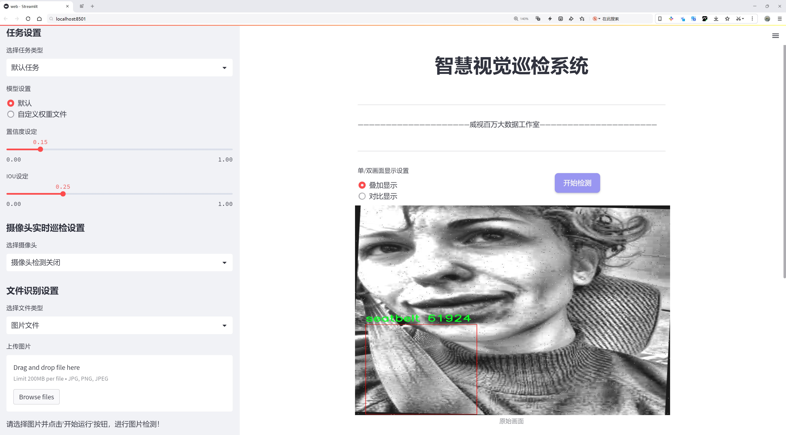
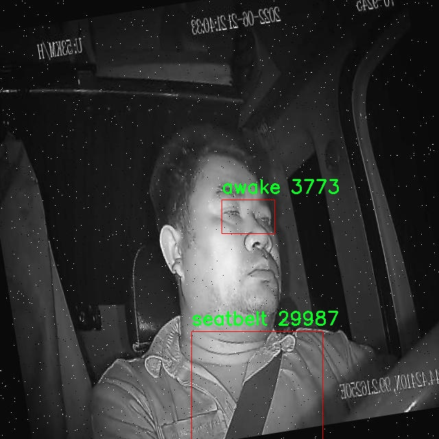

# 驾驶员危险行为检测检测系统源码分享
 # [一条龙教学YOLOV8标注好的数据集一键训练_70+全套改进创新点发刊_Web前端展示]

### 1.研究背景与意义

项目参考[AAAI Association for the Advancement of Artificial Intelligence](https://gitee.com/qunshansj/projects)

项目来源[AACV Association for the Advancement of Computer Vision](https://gitee.com/qunmasj/projects)

研究背景与意义

随着智能交通系统和自动驾驶技术的迅速发展，驾驶员的安全行为监测逐渐成为交通安全研究的重要领域。根据世界卫生组织的统计，交通事故已成为全球范围内导致死亡和伤残的主要原因之一，其中许多事故的发生与驾驶员的危险行为密切相关。因此，开发有效的驾驶员危险行为检测系统，不仅能够提高驾驶安全性，还能为智能交通管理提供重要的数据支持。

近年来，基于深度学习的目标检测技术在计算机视觉领域取得了显著进展，尤其是YOLO（You Only Look Once）系列模型因其高效性和实时性而广泛应用于各种目标检测任务。YOLOv8作为该系列的最新版本，结合了更先进的网络结构和优化算法，能够在复杂环境中实现高精度的目标检测。基于YOLOv8的驾驶员危险行为检测系统，能够实时识别驾驶员的状态和行为，从而为交通安全提供有效的技术保障。

本研究将重点关注驾驶员的五种危险行为：清醒、困倦、使用手机、未系安全带和打哈欠。这些行为在很大程度上影响了驾驶员的注意力和反应能力，进而影响行车安全。通过对这五种行为的检测，系统能够及时发出警报，提醒驾驶员注意安全，降低事故发生的风险。为实现这一目标，本研究将使用包含2200张图像的“driver-safety”数据集，该数据集涵盖了多种驾驶员状态，具有较高的代表性和实用性。

数据集中的图像数量和类别设置为本研究提供了良好的基础。每一类行为都对应着特定的视觉特征，利用YOLOv8的强大特性，系统能够快速、准确地识别这些特征，从而实现对驾驶员行为的实时监测。此外，数据集的多样性和丰富性为模型的训练和测试提供了充足的样本，确保了检测系统的鲁棒性和可靠性。

本研究的意义不仅在于技术层面的创新，更在于其对社会安全的积极影响。通过实现对驾驶员危险行为的实时监测，能够有效降低交通事故的发生率，保护驾驶员及乘客的生命安全。同时，该系统的推广应用也将推动智能交通技术的发展，为未来的智能驾驶提供重要的参考和借鉴。

综上所述，基于改进YOLOv8的驾驶员危险行为检测系统的研究，既是对现有技术的延续与创新，也是对交通安全问题的积极回应。通过本研究的深入，期望能够为提升驾驶安全、减少交通事故提供切实可行的解决方案，为构建更加安全的交通环境贡献力量。

### 2.图片演示




##### 注意：由于此博客编辑较早，上面“2.图片演示”和“3.视频演示”展示的系统图片或者视频可能为老版本，新版本在老版本的基础上升级如下：（实际效果以升级的新版本为准）

  （1）适配了YOLOV8的“目标检测”模型和“实例分割”模型，通过加载相应的权重（.pt）文件即可自适应加载模型。

  （2）支持“图片识别”、“视频识别”、“摄像头实时识别”三种识别模式。

  （3）支持“图片识别”、“视频识别”、“摄像头实时识别”三种识别结果保存导出，解决手动导出（容易卡顿出现爆内存）存在的问题，识别完自动保存结果并导出到tempDir中。

  （4）支持Web前端系统中的标题、背景图等自定义修改，后面提供修改教程。

  另外本项目提供训练的数据集和训练教程,暂不提供权重文件（best.pt）,需要您按照教程进行训练后实现图片演示和Web前端界面演示的效果。

### 3.视频演示

[3.1 视频演示](https://www.bilibili.com/video/BV1nt4UeAEv1/)

### 4.数据集信息展示

##### 4.1 本项目数据集详细数据（类别数＆类别名）

nc: 5
names: ['awake', 'drowsy', 'phone', 'seatbelt', 'yawn']


##### 4.2 本项目数据集信息介绍

数据集信息展示

在现代智能交通系统中，驾驶员的行为监测与分析已成为提高道路安全性的重要环节。为此，我们构建了一个名为“driver-safety”的数据集，旨在为改进YOLOv8的驾驶员危险行为检测系统提供丰富的训练数据。该数据集包含五个主要类别，分别是“awake”（清醒）、“drowsy”（困倦）、“phone”（使用手机）、“seatbelt”（未系安全带）和“yawn”（打哈欠）。这些类别涵盖了驾驶员在行驶过程中可能出现的多种危险行为，能够有效地帮助模型识别并判断驾驶员的状态，从而为安全驾驶提供预警。

“driver-safety”数据集的构建基于对真实驾驶场景的深入分析与观察。我们通过多种途径收集了大量视频和图像数据，确保样本的多样性和代表性。这些数据不仅来自不同的驾驶环境，如城市道路、高速公路和乡村小道，还涵盖了不同的天气条件和时间段，以增强模型的泛化能力。数据集中每个类别的样本均经过精心标注，确保其准确性和一致性，为后续的模型训练提供了坚实的基础。

在数据集的设计上，我们特别关注了驾驶员行为的多样性和复杂性。例如，在“drowsy”类别中，我们不仅包括了轻微的困倦表现，还涵盖了明显的打瞌睡状态，以便模型能够在不同程度的困倦情况下做出有效判断。而在“phone”类别中，我们则标注了驾驶员在使用手机时的多种姿态，包括单手持机、双手操作等，确保模型能够识别出各种使用手机的危险行为。

此外，为了提升数据集的实用性，我们还对样本进行了多样化处理，包括不同的拍摄角度、光照条件和背景环境。这种多样性不仅增加了数据集的丰富性，也使得模型在实际应用中能够更好地适应各种复杂的驾驶场景。我们相信，这种精心设计的数据集将为YOLOv8的训练提供强有力的支持，使其在驾驶员危险行为检测任务中表现更加出色。

在数据集的使用过程中，我们鼓励研究人员和开发者积极参与到数据集的改进与扩展中来。通过不断收集新的样本和反馈，我们希望能够持续优化“driver-safety”数据集，使其在驾驶员行为检测领域发挥更大的作用。未来，我们计划引入更多的类别和样本，以应对不断变化的驾驶环境和行为模式，确保我们的检测系统始终处于技术前沿。

总之，“driver-safety”数据集的构建与应用，不仅为驾驶员危险行为检测提供了重要的基础数据支持，也为智能交通系统的安全性提升贡献了力量。通过结合先进的深度学习技术，我们期待在未来的研究中，能够实现更高效、更准确的驾驶员行为监测，为道路安全保驾护航。





### 5.全套项目环境部署视频教程（零基础手把手教学）

[5.1 环境部署教程链接（零基础手把手教学）](https://www.ixigua.com/7404473917358506534?logTag=c807d0cbc21c0ef59de5)


[5.2 安装Python虚拟环境创建和依赖库安装视频教程链接（零基础手把手教学）](https://www.ixigua.com/7404474678003106304?logTag=1f1041108cd1f708b01a)

### 6.手把手YOLOV8训练视频教程（零基础小白有手就能学会）

[6.1 手把手YOLOV8训练视频教程（零基础小白有手就能学会）](https://www.ixigua.com/7404477157818401292?logTag=d31a2dfd1983c9668658)

### 7.70+种全套YOLOV8创新点代码加载调参视频教程（一键加载写好的改进模型的配置文件）

[7.1 70+种全套YOLOV8创新点代码加载调参视频教程（一键加载写好的改进模型的配置文件）](https://www.ixigua.com/7404478314661806627?logTag=29066f8288e3f4eea3a4)

### 8.70+种全套YOLOV8创新点原理讲解（非科班也可以轻松写刊发刊，V10版本正在科研待更新）

由于篇幅限制，每个创新点的具体原理讲解就不一一展开，具体见下列网址中的创新点对应子项目的技术原理博客网址【Blog】：


[8.1 70+种全套YOLOV8创新点原理讲解链接](https://gitee.com/qunmasj/good)

### 9.系统功能展示（检测对象为举例，实际内容以本项目数据集为准）

图9.1.系统支持检测结果表格显示

  图9.2.系统支持置信度和IOU阈值手动调节

  图9.3.系统支持自定义加载权重文件best.pt(需要你通过步骤5中训练获得)

  图9.4.系统支持摄像头实时识别

  图9.5.系统支持图片识别

  图9.6.系统支持视频识别

  图9.7.系统支持识别结果文件自动保存

  图9.8.系统支持Excel导出检测结果数据


### 10.原始YOLOV8算法原理

原始YOLOv8算法原理

YOLOv8算法是由Glenn-Jocher提出的最新一代YOLO系列目标检测算法，它在YOLOv3和YOLOv5的基础上进行了多项重要改进，旨在提升目标检测的精度和速度。YOLOv8的设计理念是通过高效的网络结构和创新的损失函数，优化目标检测任务，尤其是在复杂环境下的表现。

首先，YOLOv8在数据预处理阶段采用了多种增强手段，包括马赛克增强、混合增强、空间扰动和颜色扰动等。这些增强技术的引入，旨在提高模型对不同场景和物体的适应能力，使得模型在训练过程中能够学习到更为丰富的特征，从而在实际应用中表现出更好的鲁棒性。

在主干网络的设计上，YOLOv8延续了YOLOv5的结构特点，但对其进行了优化。YOLOv8将原有的C3模块替换为C2f模块，C2f模块通过引入更多的分支，增强了梯度回传过程中的信息流动。这种设计使得特征提取更加高效，能够更好地捕捉到图像中的细节信息。C2f模块的引入不仅提升了特征提取的能力，还在一定程度上减轻了噪声对模型性能的影响。

YOLOv8的Neck端采用了FPN（特征金字塔网络）和PAN（路径聚合网络）的结合结构，这一设计使得多尺度特征能够得到充分融合。通过上采样和下采样的操作，YOLOv8能够在不同的尺度上进行特征的聚合，从而提升对小目标的检测能力。特别是在复杂的背景下，FPN-PAN结构的有效性显得尤为重要，它能够帮助模型更好地分离目标与背景，提高目标定位的准确性。

在输出端，YOLOv8采用了解耦头结构，分别处理分类和回归任务。这种解耦设计的优势在于，它允许模型在分类和定位上进行独立优化，从而提高了整体的检测性能。通过并行的分支结构，YOLOv8能够更有效地提取类别特征和位置特征，最终实现高效的目标检测。

YOLOv8在标签分配策略上也进行了创新，采用了动态标签分配策略，而非依赖于静态的候选框。这一策略使得YOLOv8能够根据目标的实际分布情况动态调整正负样本的匹配，从而提高了训练的灵活性和准确性。YOLOv8的损失函数设计同样值得关注，其分类损失采用了Varifocal Loss，回归损失则结合了CIoU和DFL损失。这种多样化的损失函数设计，使得模型在处理不同类型的样本时能够更具针对性，进一步提升了检测的精度。

尽管YOLOv8在许多方面都取得了显著的进步，但在复杂水面环境下的应用仍然面临挑战。小目标漂浮物的特征复杂且背景多样，导致YOLOv8在这些场景下的定位精度和目标感知能力不足。因此，针对这些问题，研究者们提出了YOLOv8-WSSOD算法的改进方案，以进一步提升YOLOv8在复杂环境下的表现。

YOLOv8-WSSOD算法的改进主要体现在几个方面。首先，为了减轻主干网络下采样过程中的噪声影响，YOLOv8-WSSOD引入了捕获远程依赖的思想，采用了BiFormer双层路由注意力机制构建C2fBF模块。这一模块的设计旨在保留特征提取过程中更细粒度的上下文信息，从而提高模型对小目标的感知能力。

其次，YOLOv8-WSSOD针对小目标漏检问题，添加了一个更小的检测头，以提升网络对小目标的感知力。同时，在Neck端引入GSConv和Slim-neck技术，旨在保持检测精度的同时降低计算量，进一步提升模型的效率。

最后，YOLOv8-WSSOD使用MPDIoU损失函数替换了CIoU损失函数，以提高模型的泛化能力和精准度。这一损失函数的引入，使得模型在处理复杂场景时能够更好地适应不同的目标分布，提高了检测的稳定性。

综上所述，YOLOv8算法通过一系列创新的设计和改进，提升了目标检测的精度和速度，尤其是在复杂环境下的表现。尽管仍存在一些挑战，但通过不断的研究和改进，YOLOv8及其衍生算法有望在实际应用中展现出更强的能力。


### 11.项目核心源码讲解（再也不用担心看不懂代码逻辑）

#### 11.1 code\ultralytics\solutions\ai_gym.py

以下是对代码的核心部分进行的分析和详细注释：

```python
# Ultralytics YOLO 🚀, AGPL-3.0 license

import cv2
from ultralytics.utils.checks import check_imshow
from ultralytics.utils.plotting import Annotator

class AIGym:
    """用于管理基于姿势的实时视频流中的健身步骤的类。"""

    def __init__(self):
        """初始化 AIGym，设置视觉和图像参数的默认值。"""
        self.im0 = None  # 当前帧图像
        self.tf = None   # 线条厚度

        # 关键点和计数信息
        self.keypoints = None  # 姿势关键点
        self.poseup_angle = None  # 上升姿势角度
        self.posedown_angle = None  # 下降姿势角度
        self.threshold = 0.001  # 阈值

        # 存储阶段、计数和角度信息
        self.angle = None  # 当前角度
        self.count = None  # 当前计数
        self.stage = None  # 当前阶段
        self.pose_type = "pushup"  # 姿势类型
        self.kpts_to_check = None  # 要检查的关键点

        # 视觉信息
        self.view_img = False  # 是否显示图像
        self.annotator = None  # 注释器实例

        # 检查环境是否支持 imshow
        self.env_check = check_imshow(warn=True)

    def set_args(self, kpts_to_check, line_thickness=2, view_img=False, pose_up_angle=145.0, pose_down_angle=90.0, pose_type="pullup"):
        """
        配置 AIGym 的参数。
        Args:
            kpts_to_check (list): 用于计数的 3 个关键点
            line_thickness (int): 边界框的线条厚度
            view_img (bool): 是否显示图像
            pose_up_angle (float): 设置上升姿势的角度
            pose_down_angle (float): 设置下降姿势的角度
            pose_type: "pushup", "pullup" 或 "abworkout"
        """
        self.kpts_to_check = kpts_to_check  # 设置要检查的关键点
        self.tf = line_thickness  # 设置线条厚度
        self.view_img = view_img  # 设置是否显示图像
        self.poseup_angle = pose_up_angle  # 设置上升姿势角度
        self.posedown_angle = pose_down_angle  # 设置下降姿势角度
        self.pose_type = pose_type  # 设置姿势类型

    def start_counting(self, im0, results, frame_count):
        """
        用于计数健身步骤的函数。
        Args:
            im0 (ndarray): 当前视频流帧
            results: 姿势估计数据
            frame_count: 当前帧计数
        """
        self.im0 = im0  # 保存当前帧图像
        if frame_count == 1:
            # 初始化计数、角度和阶段
            self.count = [0] * len(results[0])
            self.angle = [0] * len(results[0])
            self.stage = ["-" for _ in results[0]]
        
        self.keypoints = results[0].keypoints.data  # 获取关键点数据
        self.annotator = Annotator(im0, line_width=2)  # 创建注释器实例

        num_keypoints = len(results[0])  # 获取关键点数量

        # 如果关键点数量变化，调整角度、计数和阶段的大小
        if len(self.angle) != num_keypoints:
            self.angle = [0] * num_keypoints
            self.count = [0] * num_keypoints
            self.stage = ["-" for _ in range(num_keypoints)]

        # 遍历每个关键点，进行姿势角度估计和计数
        for ind, k in enumerate(reversed(self.keypoints)):
            # 计算姿势角度
            self.angle[ind] = self.annotator.estimate_pose_angle(
                k[int(self.kpts_to_check[0])].cpu(),
                k[int(self.kpts_to_check[1])].cpu(),
                k[int(self.kpts_to_check[2])].cpu(),
            )
            # 绘制关键点
            self.im0 = self.annotator.draw_specific_points(k, self.kpts_to_check, shape=(640, 640), radius=10)

            # 根据姿势类型更新阶段和计数
            if self.pose_type == "pushup":
                if self.angle[ind] > self.poseup_angle:
                    self.stage[ind] = "up"
                if self.angle[ind] < self.posedown_angle and self.stage[ind] == "up":
                    self.stage[ind] = "down"
                    self.count[ind] += 1
            
            elif self.pose_type == "pullup":
                if self.angle[ind] > self.poseup_angle:
                    self.stage[ind] = "down"
                if self.angle[ind] < self.posedown_angle and self.stage[ind] == "down":
                    self.stage[ind] = "up"
                    self.count[ind] += 1
            
            # 绘制角度、计数和阶段信息
            self.annotator.plot_angle_and_count_and_stage(
                angle_text=self.angle[ind],
                count_text=self.count[ind],
                stage_text=self.stage[ind],
                center_kpt=k[int(self.kpts_to_check[1])],
                line_thickness=self.tf,
            )

            # 绘制所有关键点
            self.annotator.kpts(k, shape=(640, 640), radius=1, kpt_line=True)

        # 如果环境支持并且需要显示图像，则展示当前帧
        if self.env_check and self.view_img:
            cv2.imshow("Ultralytics YOLOv8 AI GYM", self.im0)
            if cv2.waitKey(1) & 0xFF == ord("q"):
                return

        return self.im0  # 返回处理后的图像

if __name__ == "__main__":
    AIGym()  # 创建 AIGym 实例
```

### 代码核心部分分析：
1. **类定义和初始化**：`AIGym`类用于管理健身动作的计数和姿势估计，初始化时设置了一些默认参数。
2. **参数设置**：`set_args`方法用于配置关键点、线条厚度、是否显示图像等参数。
3. **计数逻辑**：`start_counting`方法是核心功能，处理每一帧图像，估计姿势角度，更新计数和阶段，并绘制相关信息。
4. **环境检查**：使用`check_imshow`检查环境是否支持图像显示，并在需要时展示图像。

通过这些核心部分，代码实现了对健身动作的实时监测和计数功能。

这个文件定义了一个名为 `AIGym` 的类，主要用于在实时视频流中基于人体姿态来管理健身动作的计数。类的构造函数初始化了一些默认值，包括图像参数、关键点信息、计数和角度等。

在 `__init__` 方法中，首先定义了一些实例变量，例如 `im0` 用于存储当前帧图像，`tf` 用于线条的厚度，`keypoints` 用于存储关键点数据，`poseup_angle` 和 `posedown_angle` 用于设定姿态的上下角度阈值，`count` 和 `stage` 用于存储每个关键点的计数和当前阶段。`pose_type` 变量用于指定当前的健身动作类型（如俯卧撑、引体向上或腹部锻炼），而 `view_img` 则用于控制是否显示图像。

`set_args` 方法用于配置 `AIGym` 的一些参数，包括需要检查的关键点、线条厚度、是否显示图像以及上下角度阈值等。这个方法允许用户根据不同的健身动作进行自定义设置。

`start_counting` 方法是主要的计数逻辑，接受当前帧图像、姿态估计结果和帧计数作为参数。该方法首先检查帧计数，如果是第一帧，则初始化计数、角度和阶段的列表。接着，它从结果中提取关键点数据，并使用 `Annotator` 类来处理图像标注。

在处理每个关键点时，程序根据不同的健身动作类型（俯卧撑、引体向上或腹部锻炼）计算角度，并判断当前的动作阶段（如“上”或“下”）。根据角度的变化，更新计数和阶段，并在图像上绘制相应的标注，包括角度、计数和阶段信息。

最后，如果环境支持图像显示且设置为显示图像，程序会使用 OpenCV 显示当前处理的图像，并在按下“q”键时退出显示。

总的来说，这个类提供了一种基于视频流实时监测和计数健身动作的方式，结合了姿态估计和图像处理技术。

#### 11.2 ui.py

```python
import sys
import subprocess

def run_script(script_path):
    """
    使用当前 Python 环境运行指定的脚本。

    Args:
        script_path (str): 要运行的脚本路径

    Returns:
        None
    """
    # 获取当前 Python 解释器的路径
    python_path = sys.executable

    # 构建运行命令
    command = f'"{python_path}" -m streamlit run "{script_path}"'

    # 执行命令
    result = subprocess.run(command, shell=True)
    if result.returncode != 0:
        print("脚本运行出错。")


# 实例化并运行应用
if __name__ == "__main__":
    # 指定您的脚本路径
    script_path = "web.py"  # 这里直接指定脚本路径

    # 运行脚本
    run_script(script_path)  # 调用函数运行指定的脚本
```

### 代码注释说明：

1. **导入模块**：
   - `sys`：用于访问与 Python 解释器紧密相关的变量和函数。
   - `subprocess`：用于创建新进程、连接到它们的输入/输出/错误管道，并获取它们的返回码。

2. **定义 `run_script` 函数**：
   - 该函数接收一个参数 `script_path`，表示要运行的 Python 脚本的路径。
   - 使用 `sys.executable` 获取当前 Python 解释器的路径，以确保使用相同的环境运行脚本。
   - 构建命令字符串，使用 `streamlit` 模块运行指定的脚本。
   - 使用 `subprocess.run` 执行构建的命令，并检查返回码以判断脚本是否成功运行。

3. **主程序块**：
   - 使用 `if __name__ == "__main__":` 确保该代码块仅在脚本作为主程序运行时执行。
   - 指定要运行的脚本路径（这里为 `"web.py"`）。
   - 调用 `run_script` 函数，传入脚本路径以执行该脚本。

这个程序文件的主要功能是通过当前的 Python 环境来运行一个指定的脚本，具体是使用 Streamlit 框架来启动一个 Web 应用。程序首先导入了必要的模块，包括 `sys`、`os` 和 `subprocess`，以及一个自定义的路径处理模块 `abs_path`。

在 `run_script` 函数中，首先获取当前 Python 解释器的路径，这样可以确保在正确的环境中运行脚本。接着，构建一个命令字符串，该命令使用当前的 Python 解释器和 Streamlit 模块来运行指定的脚本。命令的格式是 `python -m streamlit run "script_path"`，其中 `script_path` 是传入的参数。

使用 `subprocess.run` 方法执行构建好的命令，并通过 `shell=True` 参数在 shell 中运行它。执行后，程序会检查返回的状态码，如果返回码不为零，表示脚本运行过程中出现了错误，程序会打印出相应的错误信息。

在文件的最后部分，使用 `if __name__ == "__main__":` 语句来确保只有在直接运行该文件时才会执行后面的代码。在这里，指定了要运行的脚本路径为 `web.py`，并调用 `run_script` 函数来启动这个脚本。

总的来说，这个程序的目的是为了方便地启动一个 Streamlit Web 应用，通过简单的封装使得用户可以直接运行指定的 Python 脚本。

#### 11.3 70+种YOLOv8算法改进源码大全和调试加载训练教程（非必要）\ultralytics\models\yolo\classify\predict.py

以下是经过简化和注释的核心代码部分：

```python
import torch
from ultralytics.engine.predictor import BasePredictor
from ultralytics.engine.results import Results
from ultralytics.utils import DEFAULT_CFG, ops

class ClassificationPredictor(BasePredictor):
    """
    该类扩展了 BasePredictor 类，用于基于分类模型进行预测。
    """

    def __init__(self, cfg=DEFAULT_CFG, overrides=None, _callbacks=None):
        """初始化 ClassificationPredictor，将任务设置为 'classify'。"""
        super().__init__(cfg, overrides, _callbacks)  # 调用父类构造函数
        self.args.task = 'classify'  # 设置任务类型为分类

    def preprocess(self, img):
        """将输入图像转换为模型兼容的数据类型。"""
        # 如果输入不是张量，则将其转换为张量
        if not isinstance(img, torch.Tensor):
            img = torch.stack([self.transforms(im) for im in img], dim=0)  # 应用转换并堆叠
        # 将图像移动到模型所在的设备上
        img = (img if isinstance(img, torch.Tensor) else torch.from_numpy(img)).to(self.model.device)
        # 根据模型的精度设置将图像转换为半精度或单精度浮点数
        return img.half() if self.model.fp16 else img.float()  # uint8 转换为 fp16/32

    def postprocess(self, preds, img, orig_imgs):
        """对预测结果进行后处理，返回 Results 对象。"""
        # 如果原始图像不是列表，则将其转换为 numpy 数组
        if not isinstance(orig_imgs, list):
            orig_imgs = ops.convert_torch2numpy_batch(orig_imgs)

        results = []  # 存储结果的列表
        for i, pred in enumerate(preds):  # 遍历每个预测结果
            orig_img = orig_imgs[i]  # 获取对应的原始图像
            img_path = self.batch[0][i]  # 获取图像路径
            # 创建 Results 对象并添加到结果列表中
            results.append(Results(orig_img, path=img_path, names=self.model.names, probs=pred))
        return results  # 返回结果列表
```

### 代码注释说明：
1. **导入必要的库**：引入 `torch` 和其他需要的模块。
2. **ClassificationPredictor 类**：这是一个用于分类任务的预测器类，继承自 `BasePredictor`。
3. **初始化方法**：在初始化时设置任务类型为分类，并调用父类的初始化方法。
4. **预处理方法**：将输入图像转换为适合模型的格式，支持将图像从 numpy 数组转换为 PyTorch 张量，并根据模型的精度设置转换数据类型。
5. **后处理方法**：将模型的预测结果转换为 `Results` 对象，便于后续使用。这里处理了原始图像的格式转换，并将每个预测结果与其对应的原始图像和路径一起存储。

该程序文件是一个用于YOLOv8分类模型预测的Python脚本，属于Ultralytics YOLO项目的一部分。文件中定义了一个名为`ClassificationPredictor`的类，该类继承自`BasePredictor`，用于处理图像分类任务。

在类的文档字符串中，说明了该类的用途和使用示例。用户可以通过传递不同的模型参数（例如`model='resnet18'`）来使用Torchvision的分类模型。示例代码展示了如何创建一个`ClassificationPredictor`实例，并调用`predict_cli`方法进行预测。

构造函数`__init__`初始化了`ClassificationPredictor`类，并将任务类型设置为“classify”。它调用了父类的构造函数，并传递了配置、覆盖参数和回调函数。

`preprocess`方法负责对输入图像进行预处理，以确保其符合模型的输入要求。首先，它检查输入是否为PyTorch张量，如果不是，则将其转换为张量。接着，图像会被移动到模型所在的设备上（如GPU），并根据模型的精度设置将数据类型转换为半精度（fp16）或单精度（fp32）。

`postprocess`方法用于对模型的预测结果进行后处理，返回一个`Results`对象的列表。它首先检查原始图像是否为列表，如果不是，则将其转换为NumPy数组。然后，对于每个预测结果，方法会提取原始图像和对应的图像路径，并将这些信息与预测概率一起存储在`Results`对象中，最终返回这些结果。

整体而言，该文件提供了一个清晰的接口，方便用户使用YOLOv8模型进行图像分类，并对输入和输出进行了必要的处理，以确保模型的有效性和准确性。

#### 11.4 70+种YOLOv8算法改进源码大全和调试加载训练教程（非必要）\ultralytics\solutions\ai_gym.py

以下是经过简化和注释的核心代码部分：

```python
import cv2
from ultralytics.utils.plotting import Annotator

class AIGym:
    """管理实时视频流中人们的健身动作计数的类。"""

    def __init__(self):
        """初始化AIGym类的默认参数。"""
        self.im0 = None  # 当前帧图像
        self.tf = None   # 线条厚度
        self.keypoints = None  # 关键点数据
        self.poseup_angle = None  # 上升姿势角度
        self.posedown_angle = None  # 下降姿势角度
        self.threshold = 0.001  # 阈值
        self.angle = None  # 姿势角度
        self.count = None  # 动作计数
        self.stage = None  # 当前阶段
        self.pose_type = 'pushup'  # 姿势类型（如俯卧撑）
        self.kpts_to_check = None  # 需要检查的关键点
        self.view_img = False  # 是否显示图像
        self.annotator = None  # 注释工具

    def set_args(self, kpts_to_check, line_thickness=2, view_img=False, pose_up_angle=145.0, pose_down_angle=90.0, pose_type='pullup'):
        """
        配置AIGym的参数。
        Args:
            kpts_to_check (list): 用于计数的3个关键点
            line_thickness (int): 边框线条的厚度
            view_img (bool): 是否显示图像
            pose_up_angle (float): 上升姿势的角度
            pose_down_angle (float): 下降姿势的角度
            pose_type: "pushup", "pullup" 或 "abworkout"
        """
        self.kpts_to_check = kpts_to_check
        self.tf = line_thickness
        self.view_img = view_img
        self.poseup_angle = pose_up_angle
        self.posedown_angle = pose_down_angle
        self.pose_type = pose_type

    def start_counting(self, im0, results, frame_count):
        """
        计数健身动作的函数。
        Args:
            im0 (ndarray): 当前视频帧
            results: 姿势估计数据
            frame_count: 当前帧计数
        """
        self.im0 = im0  # 保存当前帧
        if frame_count == 1:
            # 初始化计数和角度
            self.count = [0] * len(results[0])
            self.angle = [0] * len(results[0])
            self.stage = ['-' for _ in results[0]]
        
        self.keypoints = results[0].keypoints.data  # 获取关键点数据
        self.annotator = Annotator(im0, line_width=2)  # 初始化注释工具

        # 遍历每个关键点
        for ind, k in enumerate(reversed(self.keypoints)):
            # 计算姿势角度
            self.angle[ind] = self.annotator.estimate_pose_angle(
                k[int(self.kpts_to_check[0])].cpu(),
                k[int(self.kpts_to_check[1])].cpu(),
                k[int(self.kpts_to_check[2])].cpu()
            )
            self.im0 = self.annotator.draw_specific_points(k, self.kpts_to_check, shape=(640, 640), radius=10)

            # 根据姿势类型更新计数和阶段
            if self.pose_type == 'pushup':
                self.update_count_pushup(ind)
            elif self.pose_type == 'pullup':
                self.update_count_pullup(ind)
            elif self.pose_type == 'abworkout':
                self.update_count_abworkout(ind)

            # 绘制关键点
            self.annotator.kpts(k, shape=(640, 640), radius=1, kpt_line=True)

        # 如果需要显示图像
        if self.view_img:
            cv2.imshow('Ultralytics YOLOv8 AI GYM', self.im0)
            if cv2.waitKey(1) & 0xFF == ord('q'):
                return

    def update_count_pushup(self, ind):
        """更新俯卧撑的计数和阶段"""
        if self.angle[ind] > self.poseup_angle:
            self.stage[ind] = 'up'
        if self.angle[ind] < self.posedown_angle and self.stage[ind] == 'up':
            self.stage[ind] = 'down'
            self.count[ind] += 1
        self.annotator.plot_angle_and_count_and_stage(
            angle_text=self.angle[ind],
            count_text=self.count[ind],
            stage_text=self.stage[ind],
            center_kpt=self.keypoints[ind][int(self.kpts_to_check[1])],
            line_thickness=self.tf
        )

    def update_count_pullup(self, ind):
        """更新引体向上的计数和阶段"""
        if self.angle[ind] > self.poseup_angle:
            self.stage[ind] = 'down'
        if self.angle[ind] < self.posedown_angle and self.stage[ind] == 'down':
            self.stage[ind] = 'up'
            self.count[ind] += 1
        self.annotator.plot_angle_and_count_and_stage(
            angle_text=self.angle[ind],
            count_text=self.count[ind],
            stage_text=self.stage[ind],
            center_kpt=self.keypoints[ind][int(self.kpts_to_check[1])],
            line_thickness=self.tf
        )

    def update_count_abworkout(self, ind):
        """更新腹部锻炼的计数和阶段"""
        if self.angle[ind] > self.poseup_angle:
            self.stage[ind] = 'down'
        if self.angle[ind] < self.posedown_angle and self.stage[ind] == 'down':
            self.stage[ind] = 'up'
            self.count[ind] += 1
        self.annotator.plot_angle_and_count_and_stage(
            angle_text=self.angle[ind],
            count_text=self.count[ind],
            stage_text=self.stage[ind],
            center_kpt=self.keypoints[ind][int(self.kpts_to_check[1])],
            line_thickness=self.tf
        )

if __name__ == '__main__':
    AIGym()  # 实例化AIGym类
```

### 代码说明：
1. **类的初始化**：`__init__`方法中定义了类的基本属性，包括图像、关键点、计数和阶段等。
2. **参数设置**：`set_args`方法用于配置健身动作的相关参数，例如需要检查的关键点、线条厚度和姿势类型等。
3. **计数逻辑**：`start_counting`方法是核心功能，用于根据姿势估计结果实时更新健身动作的计数和阶段。
4. **更新计数**：根据不同的姿势类型（俯卧撑、引体向上、腹部锻炼），分别在`update_count_pushup`、`update_count_pullup`和`update_count_abworkout`方法中更新计数和阶段。
5. **图像显示**：如果设置了显示图像，则使用OpenCV显示当前帧，并在按下'q'键时退出。

这个程序文件定义了一个名为 `AIGym` 的类，主要用于在实时视频流中基于人体姿态来管理健身动作的计数。代码的结构清晰，功能主要集中在对不同健身动作（如俯卧撑、引体向上和腹部锻炼）的检测和计数上。

在类的初始化方法 `__init__` 中，设置了一些默认值，包括图像参数、关键点信息、角度阈值等。这里的 `im0` 用于存储当前帧图像，`tf` 表示线条的厚度，`keypoints` 用于存储关键点数据，`poseup_angle` 和 `posedown_angle` 分别定义了姿势的上限和下限角度，`pose_type` 用于指定当前的健身动作类型。

`set_args` 方法用于配置一些参数，包括需要检查的关键点、线条厚度、是否显示图像、上升和下降的角度阈值以及健身动作类型。这个方法允许用户根据需要自定义这些参数。

`start_counting` 方法是主要的计数逻辑，接收当前帧图像、姿态估计结果和帧计数作为输入。首先，它会在第一帧时初始化计数和角度列表。然后，通过遍历关键点，计算出每个关键点的姿态角度，并根据设定的健身动作类型来判断当前的姿势状态（如“上”或“下”）。根据姿势的变化，更新计数和状态，并在图像上绘制相关信息（如角度、计数和状态）。

在不同的健身动作类型中，程序会根据姿态角度的变化来判断动作的完成情况。例如，在俯卧撑中，当角度大于上限角度时，状态为“上”；当角度小于下限角度且状态为“上”时，状态变为“下”，并增加计数。引体向上和腹部锻炼的逻辑类似，但具体的角度阈值和状态判断可能有所不同。

最后，如果设置了 `view_img` 为真，程序会使用 OpenCV 显示当前帧图像，并允许用户通过按下 'q' 键退出显示。

总的来说，这段代码通过结合姿态估计和图像处理技术，实现了一个简单的健身动作计数器，能够实时监测用户的健身动作并提供反馈。

#### 11.5 70+种YOLOv8算法改进源码大全和调试加载训练教程（非必要）\ultralytics\nn\extra_modules\RFAConv.py

以下是经过简化和注释的核心代码部分：

```python
import torch
import torch.nn as nn
from einops import rearrange

class h_sigmoid(nn.Module):
    """实现h-sigmoid激活函数"""
    def __init__(self, inplace=True):
        super(h_sigmoid, self).__init__()
        self.relu = nn.ReLU6(inplace=inplace)

    def forward(self, x):
        return self.relu(x + 3) / 6  # 计算h-sigmoid

class h_swish(nn.Module):
    """实现h-swish激活函数"""
    def __init__(self, inplace=True):
        super(h_swish, self).__init__()
        self.sigmoid = h_sigmoid(inplace=inplace)

    def forward(self, x):
        return x * self.sigmoid(x)  # 计算h-swish

class RFAConv(nn.Module):
    """RFA卷积模块"""
    def __init__(self, in_channel, out_channel, kernel_size, stride=1):
        super().__init__()
        self.kernel_size = kernel_size

        # 权重生成网络
        self.get_weight = nn.Sequential(
            nn.AvgPool2d(kernel_size=kernel_size, padding=kernel_size // 2, stride=stride),
            nn.Conv2d(in_channel, in_channel * (kernel_size ** 2), kernel_size=1, groups=in_channel, bias=False)
        )
        
        # 特征生成网络
        self.generate_feature = nn.Sequential(
            nn.Conv2d(in_channel, in_channel * (kernel_size ** 2), kernel_size=kernel_size, padding=kernel_size // 2, stride=stride, groups=in_channel, bias=False),
            nn.BatchNorm2d(in_channel * (kernel_size ** 2)),
            nn.ReLU()
        )
        
        # 最终卷积层
        self.conv = nn.Conv2d(in_channel, out_channel, kernel_size=kernel_size, stride=kernel_size)

    def forward(self, x):
        b, c = x.shape[0:2]  # 获取批次大小和通道数
        weight = self.get_weight(x)  # 生成权重
        h, w = weight.shape[2:]  # 获取特征图的高和宽
        
        # 计算权重并进行softmax归一化
        weighted = weight.view(b, c, self.kernel_size ** 2, h, w).softmax(2)
        feature = self.generate_feature(x).view(b, c, self.kernel_size ** 2, h, w)  # 生成特征
        
        # 加权特征
        weighted_data = feature * weighted
        conv_data = rearrange(weighted_data, 'b c (n1 n2) h w -> b c (h n1) (w n2)', n1=self.kernel_size, n2=self.kernel_size)
        
        return self.conv(conv_data)  # 返回卷积结果

class SE(nn.Module):
    """Squeeze-and-Excitation模块"""
    def __init__(self, in_channel, ratio=16):
        super(SE, self).__init__()
        self.gap = nn.AdaptiveAvgPool2d((1, 1))  # 全局平均池化
        self.fc = nn.Sequential(
            nn.Linear(in_channel, ratio, bias=False),  # 从c到c/r
            nn.ReLU(),
            nn.Linear(ratio, in_channel, bias=False),  # 从c/r到c
            nn.Sigmoid()
        )

    def forward(self, x):
        b, c = x.shape[0:2]
        y = self.gap(x).view(b, c)  # 计算全局特征
        y = self.fc(y).view(b, c, 1, 1)  # 通过全连接层
        return y  # 返回通道注意力

class RFCBAMConv(nn.Module):
    """RFCBAM卷积模块"""
    def __init__(self, in_channel, out_channel, kernel_size=3, stride=1):
        super().__init__()
        self.kernel_size = kernel_size
        
        # 特征生成网络
        self.generate = nn.Sequential(
            nn.Conv2d(in_channel, in_channel * (kernel_size ** 2), kernel_size, padding=kernel_size // 2, stride=stride, groups=in_channel, bias=False),
            nn.BatchNorm2d(in_channel * (kernel_size ** 2)),
            nn.ReLU()
        )
        
        # 权重生成网络
        self.get_weight = nn.Sequential(nn.Conv2d(2, 1, kernel_size=3, padding=1, bias=False), nn.Sigmoid())
        self.se = SE(in_channel)  # 引入SE模块

        # 最终卷积层
        self.conv = nn.Conv2d(in_channel, out_channel, kernel_size=kernel_size, stride=kernel_size)

    def forward(self, x):
        b, c = x.shape[0:2]
        channel_attention = self.se(x)  # 计算通道注意力
        generate_feature = self.generate(x)  # 生成特征

        h, w = generate_feature.shape[2:]
        generate_feature = generate_feature.view(b, c, self.kernel_size ** 2, h, w)  # 变形
        
        # 特征重排列
        generate_feature = rearrange(generate_feature, 'b c (n1 n2) h w -> b c (h n1) (w n2)', n1=self.kernel_size, n2=self.kernel_size)
        
        # 加权特征
        unfold_feature = generate_feature * channel_attention
        max_feature, _ = torch.max(generate_feature, dim=1, keepdim=True)  # 最大特征
        mean_feature = torch.mean(generate_feature, dim=1, keepdim=True)  # 平均特征
        
        # 计算接收场注意力
        receptive_field_attention = self.get_weight(torch.cat((max_feature, mean_feature), dim=1))
        conv_data = unfold_feature * receptive_field_attention  # 加权特征
        
        return self.conv(conv_data)  # 返回卷积结果
```

### 代码说明：
1. **h_sigmoid 和 h_swish**：实现了h-sigmoid和h-swish激活函数，分别用于激活神经网络中的特征。
2. **RFAConv**：实现了一个基于加权特征的卷积模块，首先生成特征，然后通过权重进行加权，最后通过卷积层输出结果。
3. **SE**：实现了Squeeze-and-Excitation模块，用于计算通道注意力，增强重要特征的表达。
4. **RFCBAMConv**：结合了特征生成、通道注意力和接收场注意力的卷积模块，旨在提高特征提取的效果。

以上代码是实现深度学习模型中重要的卷积模块，适用于图像处理和计算机视觉任务。

这个程序文件定义了一些用于深度学习模型的卷积模块，主要是针对YOLOv8算法的改进。文件中包含了几个类，分别是`h_sigmoid`、`h_swish`、`RFAConv`、`RFCBAMConv`和`RFCAConv`，每个类都有其特定的功能和结构。

首先，`h_sigmoid`和`h_swish`是自定义的激活函数。`h_sigmoid`是一个高阶的sigmoid函数，它通过ReLU6函数进行处理，使得输出在0到1之间。`h_swish`则结合了`h_sigmoid`和输入值，形成了一个新的激活函数，能够在一定程度上提高模型的表现。

接下来是`RFAConv`类，它实现了一种新的卷积操作。该类的构造函数中定义了几个子模块，包括用于生成权重的平均池化和卷积层，以及用于生成特征的卷积层和批归一化层。在前向传播中，输入数据首先通过这些子模块生成权重和特征，然后进行加权操作，最后通过卷积层输出结果。这种设计可以增强模型对特征的学习能力。

`RFCBAMConv`类是另一个卷积模块，它结合了通道注意力机制。构造函数中定义了生成特征的卷积层、通道注意力的计算层以及最终的卷积层。在前向传播中，输入数据经过特征生成和通道注意力的处理，最后通过卷积层输出结果。这种设计可以帮助模型更好地关注重要的特征。

最后，`RFCAConv`类是一个结合了空间注意力机制的卷积模块。它的构造函数中定义了特征生成层、全局平均池化层和多个卷积层。在前向传播中，输入数据经过特征生成、空间注意力计算和最终卷积操作，输出结果。通过这种方式，模型能够在空间维度上自适应地调整特征的权重。

总体来说，这个文件实现了一些先进的卷积操作和注意力机制，旨在提升YOLOv8算法在目标检测任务中的性能。每个模块的设计都考虑到了特征的生成、加权和最终的卷积操作，以实现更好的特征提取和表示能力。

#### 11.6 train.py

以下是代码中最核心的部分，并附上详细的中文注释：

```python
class DetectionTrainer(BaseTrainer):
    """
    DetectionTrainer类扩展了BaseTrainer类，用于基于检测模型的训练。
    """

    def build_dataset(self, img_path, mode="train", batch=None):
        """
        构建YOLO数据集。

        参数:
            img_path (str): 包含图像的文件夹路径。
            mode (str): 模式，`train`表示训练模式，`val`表示验证模式，用户可以为每种模式自定义不同的增强。
            batch (int, optional): 批次大小，仅用于`rect`模式。默认为None。
        """
        gs = max(int(de_parallel(self.model).stride.max() if self.model else 0), 32)  # 获取模型的最大步幅
        return build_yolo_dataset(self.args, img_path, batch, self.data, mode=mode, rect=mode == "val", stride=gs)

    def get_dataloader(self, dataset_path, batch_size=16, rank=0, mode="train"):
        """构造并返回数据加载器。"""
        assert mode in ["train", "val"]  # 确保模式为训练或验证
        with torch_distributed_zero_first(rank):  # 如果使用分布式数据并行，确保只初始化一次数据集
            dataset = self.build_dataset(dataset_path, mode, batch_size)  # 构建数据集
        shuffle = mode == "train"  # 训练模式下打乱数据
        if getattr(dataset, "rect", False) and shuffle:
            LOGGER.warning("WARNING ⚠️ 'rect=True'与DataLoader的shuffle不兼容，设置shuffle=False")
            shuffle = False  # 如果使用rect模式，则不打乱数据
        workers = self.args.workers if mode == "train" else self.args.workers * 2  # 根据模式设置工作线程数
        return build_dataloader(dataset, batch_size, workers, shuffle, rank)  # 返回数据加载器

    def preprocess_batch(self, batch):
        """对一批图像进行预处理，包括缩放和转换为浮点数。"""
        batch["img"] = batch["img"].to(self.device, non_blocking=True).float() / 255  # 将图像转换为浮点数并归一化
        if self.args.multi_scale:  # 如果启用多尺度训练
            imgs = batch["img"]
            sz = (
                random.randrange(self.args.imgsz * 0.5, self.args.imgsz * 1.5 + self.stride)
                // self.stride
                * self.stride
            )  # 随机选择一个新的尺寸
            sf = sz / max(imgs.shape[2:])  # 计算缩放因子
            if sf != 1:
                ns = [
                    math.ceil(x * sf / self.stride) * self.stride for x in imgs.shape[2:]
                ]  # 计算新的形状
                imgs = nn.functional.interpolate(imgs, size=ns, mode="bilinear", align_corners=False)  # 进行插值缩放
            batch["img"] = imgs  # 更新批次中的图像
        return batch

    def get_model(self, cfg=None, weights=None, verbose=True):
        """返回YOLO检测模型。"""
        model = DetectionModel(cfg, nc=self.data["nc"], verbose=verbose and RANK == -1)  # 创建检测模型
        if weights:
            model.load(weights)  # 加载权重
        return model

    def get_validator(self):
        """返回用于YOLO模型验证的DetectionValidator。"""
        self.loss_names = "box_loss", "cls_loss", "dfl_loss"  # 定义损失名称
        return yolo.detect.DetectionValidator(
            self.test_loader, save_dir=self.save_dir, args=copy(self.args), _callbacks=self.callbacks
        )  # 返回验证器

    def plot_training_samples(self, batch, ni):
        """绘制带有注释的训练样本。"""
        plot_images(
            images=batch["img"],
            batch_idx=batch["batch_idx"],
            cls=batch["cls"].squeeze(-1),
            bboxes=batch["bboxes"],
            paths=batch["im_file"],
            fname=self.save_dir / f"train_batch{ni}.jpg",
            on_plot=self.on_plot,
        )  # 绘制图像并保存

    def plot_metrics(self):
        """从CSV文件中绘制指标。"""
        plot_results(file=self.csv, on_plot=self.on_plot)  # 保存结果图像
```

### 代码核心部分说明：
1. **DetectionTrainer类**：这是一个用于训练YOLO检测模型的类，继承自BaseTrainer。
2. **build_dataset方法**：构建YOLO数据集，支持训练和验证模式。
3. **get_dataloader方法**：创建数据加载器，支持多线程和数据打乱。
4. **preprocess_batch方法**：对输入图像进行预处理，包括归一化和缩放。
5. **get_model方法**：返回YOLO检测模型，并可选择加载预训练权重。
6. **get_validator方法**：返回用于模型验证的验证器。
7. **plot_training_samples和plot_metrics方法**：用于可视化训练样本和绘制训练指标。

这个程序文件 `train.py` 是一个用于训练 YOLO（You Only Look Once）目标检测模型的脚本，继承自 `BaseTrainer` 类。程序的主要功能是构建数据集、创建数据加载器、预处理图像、设置模型属性、获取模型、验证模型、记录损失、绘制训练样本和绘制训练指标等。

首先，程序导入了一些必要的库和模块，包括数学计算、随机数生成、深度学习相关的 PyTorch 模块，以及 Ultralytics 提供的用于构建数据集和模型的工具。接着，定义了 `DetectionTrainer` 类，该类专门用于基于检测模型的训练。

在 `DetectionTrainer` 类中，`build_dataset` 方法用于构建 YOLO 数据集，接收图像路径、模式（训练或验证）和批量大小作为参数。它会根据模型的步幅计算出合适的图像尺寸，并调用 `build_yolo_dataset` 函数来创建数据集。

`get_dataloader` 方法则用于构建数据加载器，确保在分布式训练时只初始化一次数据集，并根据模式选择是否打乱数据。它还会根据模式设置工作线程的数量，并返回构建好的数据加载器。

`preprocess_batch` 方法负责对图像批次进行预处理，包括将图像缩放到适当的大小并转换为浮点数格式。它支持多尺度训练，通过随机选择图像大小来增强模型的鲁棒性。

`set_model_attributes` 方法用于设置模型的属性，包括类别数量和类别名称等。这些属性是根据数据集的信息进行配置的。

`get_model` 方法返回一个 YOLO 检测模型，可以选择加载预训练权重。`get_validator` 方法则返回一个用于验证模型的 `DetectionValidator` 实例，记录损失名称并设置保存目录。

`label_loss_items` 方法用于返回带有标签的训练损失字典，方便后续的损失记录和分析。`progress_string` 方法返回一个格式化的字符串，显示训练进度，包括当前的轮次、GPU 内存使用情况、损失值、实例数量和图像大小等信息。

`plot_training_samples` 方法用于绘制训练样本及其标注，帮助可视化训练过程中的数据。最后，`plot_metrics` 和 `plot_training_labels` 方法分别用于绘制训练指标和创建带标签的训练图，便于分析模型的性能和训练效果。

整体来看，这个文件提供了一个完整的训练流程，涵盖了数据准备、模型训练、验证和结果可视化等多个方面，旨在帮助用户高效地训练 YOLO 模型进行目标检测任务。

### 12.系统整体结构（节选）

### 整体功能和构架概括

该项目主要是一个基于YOLOv8的目标检测和分类框架，包含了多个模块和文件，用于实现从数据准备、模型训练到推理和结果可视化的完整流程。整体架构分为几个主要部分：

1. **数据处理**：包括数据集的构建、数据加载和预处理，确保模型能够有效地学习。
2. **模型定义**：实现了YOLOv8模型及其改进版本，结合了多种卷积模块和注意力机制，以提升模型性能。
3. **训练过程**：提供了训练脚本，支持多种训练配置，能够记录损失、绘制训练指标等。
4. **推理与预测**：实现了模型的推理功能，能够对输入图像进行分类和目标检测。
5. **可视化**：包括绘制训练样本、损失和性能指标，帮助用户理解模型的训练过程和效果。

以下是每个文件的功能整理表格：

| 文件路径                                                                                              | 功能描述                                                                                           |
|-----------------------------------------------------------------------------------------------------|---------------------------------------------------------------------------------------------------|
| `code\ultralytics\solutions\ai_gym.py`                                                              | 实现了基于人体姿态的健身动作计数器，结合姿态估计和图像处理技术，实时监测健身动作。                      |
| `ui.py`                                                                                              | 启动一个Streamlit Web应用，用于方便地运行指定的Python脚本。                                        |
| `70+种YOLOv8算法改进源码大全和调试加载训练教程（非必要）\ultralytics\models\yolo\classify\predict.py` | 提供YOLOv8分类模型的预测功能，包含图像预处理和后处理逻辑。                                         |
| `70+种YOLOv8算法改进源码大全和调试加载训练教程（非必要）\ultralytics\nn\extra_modules\RFAConv.py`  | 定义了多个自定义卷积模块和激活函数，结合注意力机制以提升YOLOv8模型的性能。                          |
| `train.py`                                                                                           | 负责YOLO模型的训练过程，包括数据集构建、模型训练、损失记录和可视化等功能。                          |
| `70+种YOLOv8算法改进源码大全和调试加载训练教程（非必要）\ultralytics\models\utils\__init__.py`      | 初始化YOLOv8模型的工具模块，提供各种辅助功能。                                                    |
| `70+种YOLOv8算法改进源码大全和调试加载训练教程（非必要）\ultralytics\engine\predictor.py`         | 实现模型的推理功能，负责处理输入数据并生成预测结果。                                             |
| `code\ultralytics\data\__init__.py`                                                                 | 初始化数据处理模块，提供数据集相关的功能和接口。                                                  |
| `70+种YOLOv8算法改进源码大全和调试加载训练教程（非必要）\ultralytics\utils\callbacks\clearml.py`   | 集成ClearML工具，支持训练过程中的实验管理和监控。                                                |
| `70+种YOLOv8算法改进源码大全和调试加载训练教程（非必要）\ultralytics\utils\benchmarks.py`         | 提供基准测试功能，用于评估模型的性能和效率。                                                      |
| `code\ultralytics\models\utils\loss.py`                                                             | 定义损失函数，用于训练过程中计算模型的损失值。                                                    |
| `70+种YOLOv8算法改进源码大全和调试加载训练教程（非必要）\ultralytics\nn\extra_modules\block.py`    | 实现了一些基本的神经网络模块，供YOLOv8模型使用。                                                  |

这个表格总结了每个文件的主要功能，展示了项目的整体架构和模块化设计。

注意：由于此博客编辑较早，上面“11.项目核心源码讲解（再也不用担心看不懂代码逻辑）”中部分代码可能会优化升级，仅供参考学习，完整“训练源码”、“Web前端界面”和“70+种创新点源码”以“13.完整训练+Web前端界面+70+种创新点源码、数据集获取”的内容为准。

### 13.完整训练+Web前端界面+70+种创新点源码、数据集获取


# [下载链接：https://mbd.pub/o/bread/ZpuVmJ5x](https://mbd.pub/o/bread/ZpuVmJ5x)